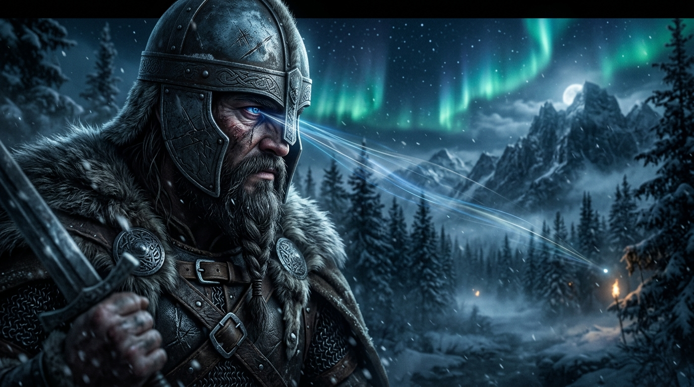
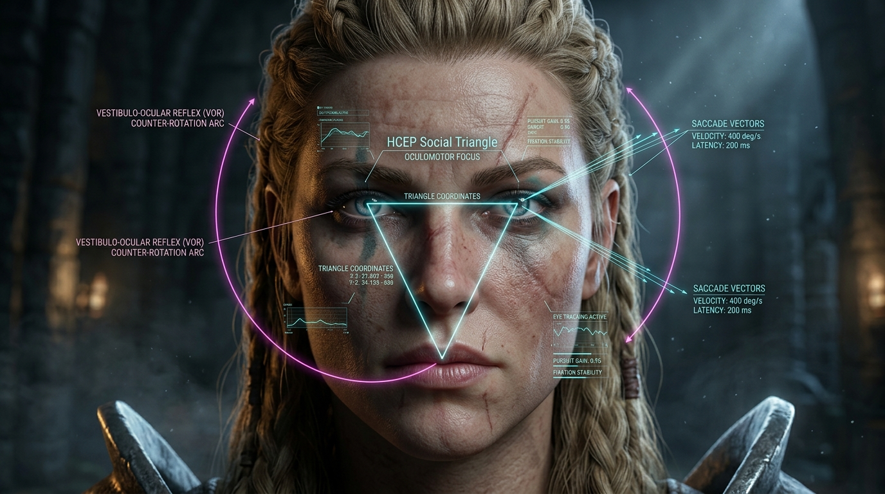
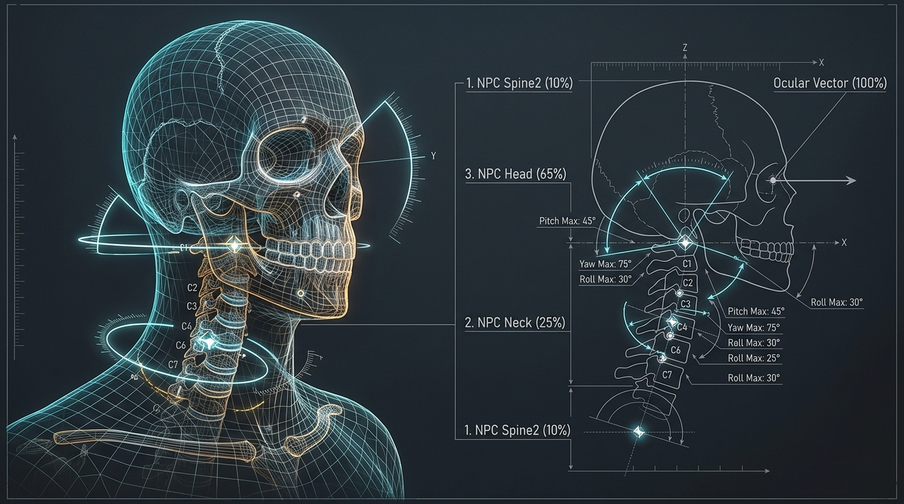
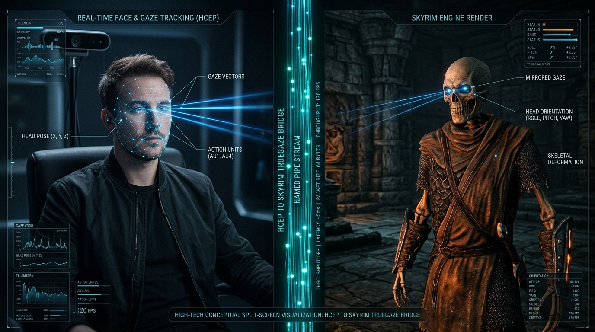
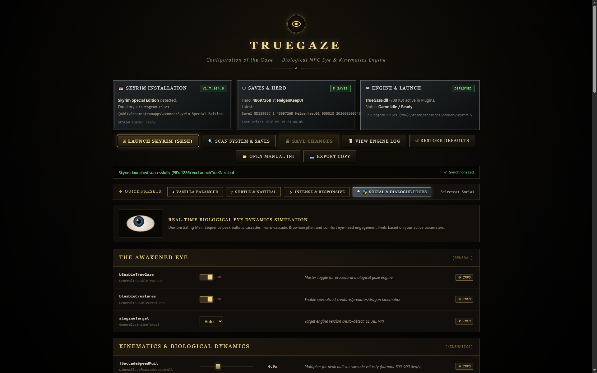

# TRUE GAZE™ (`TrueGaze`)

## Biological NPC Gaze & Biomechanical Kinematics Engine

### A First-Party Product of the Human Communication Eye Protocol (HCEP) Architecture

[](#-current-project-status)
[](#)
[](#)
[](#)
[](#)
[](LICENSE)

**Architect & Product Owner:** Kirk LaSalle  
**Repository:** `https://github.com/kirklasalle/SkyrimTrueGaze`  
**Native Binary:** `TrueGaze.dll` (SKSE64 / CommonLibSSE-NG)  
**Target Platform:** The Elder Scrolls V: Skyrim (SE 1.5.97, AE 1.6.640+, AE 1.6.1170+, Skyrim VR) & Modern Creation Engine

<p align="center">
  
</p>

> [!IMPORTANT]
> **Documentation vs. Implementation.** The architecture sections below describe the *designed* TrueGaze system — the target. The runtime has now been exercised inside Skyrim AE: the plugin loads through SKSE, actor hooks invoke, eligible actors tick, targets resolve, skeletons are probed, HCEP telemetry is consumed, and diagnostic light emitters attach. **The visible beam/geometry illustration layer remains under development** and is not yet verified as rendered in-game. For the verified capability matrix, see **[`docs/STATUS.md`](docs/STATUS.md)**, the current roadmap in **[`ROADMAP.md`](ROADMAP.md)**, and the independent **[`docs/AUDIT_REPORT_2026-09-11.md`](docs/AUDIT_REPORT_2026-09-11.md)**.

---

## 📌 Current Project Status

| | |
| :--- | :--- |
| **Maturity** | 🟡 **~65%** of a shippable 1.0.0 |
| **Builds & links the SDK?** | ✅ Yes — DLL is 637 KB and imports `CommonLibSSE`, `spdlog`, `fmt` |
| **Drives bones?** | ✅ Yes — implemented and compiled |
| **Verified in-game?** | ✅ **Runtime verified** — plugin load, actor ticks, target resolution, skeleton probing, telemetry, and diagnostic emitters are confirmed |
| **Visible illustration layer** | 🔨 **In development** — beam geometry/resource loading remains unresolved |

**Verified working:** SDK linkage · the gaze engine and bone application · per-actor runtime kinematics state · configuration reaching the live engine · Main Sequence velocity profile · Ornstein-Uhlenbeck drift · triple-buffered IPC with a user-scoped pipe ACL · a public C API that returns live state · 11 passing test suites · a reproducible pinned build.

**In-engine verified:** the plugin has been run in Skyrim AE and its runtime path is producing actor ticks, target resolutions, skeleton probes, telemetry state, and attached diagnostic lights. **Not yet verified:** a visible beam or mesh illustration rendered in-world. That visual layer is the next development milestone and is separate from the verified runtime gaze pipeline.

**Still open:** OAR condition registration (#6) · `.pdb` files are not packaged · GitHub Actions does not run on this account for private repositories (#9).

➡️ **Full capability matrix and remediation plan: [`docs/STATUS.md`](docs/STATUS.md)**

➡️ **User guide: [`docs/USER_GUIDE.md`](docs/USER_GUIDE.md)**  
➡️ **Developer guide: [`docs/DEVELOPER_GUIDE.md`](docs/DEVELOPER_GUIDE.md)**

---

## 1. Executive Summary & Brand Positioning

**True Gaze™** is an advanced biomechanical perception and kinematics engine designed to eradicate the "dead-eye zombie syndrome" pervasive in game engines. Developed as a specialized gaming product of Kirk LaSalle's **Human Communication Eye Protocol (HCEP)**, `TrueGaze` bridges 50 years of psycholinguistic and neuroscience research (Argyle & Cook, Kendon, Glenberg) into real-time 3D game characters.

Unlike traditional head-tracking mods that apply rigid spherical interpolation directly to the neck bone, `TrueGaze` models the **human oculomotor system**:

* **Eyes lead, head follows** via the Vestibulo-Ocular Reflex (VOR).
* **Ballistic Saccades** calculated via the empirical Main Sequence equation.
* **Micro-saccadic Brownian drift** preventing visual freezing.
* **Cognitive Gaze Aversion (THINK Mode)** and **Social Triangle Cycling (AFFECT Mode)**.
* **Deep Open Animation Replacer (OAR) integration**, allowing modders to trigger bespoke body gestures based on real-time gaze and cognitive states.

<p align="center">
  
  <br>
  <em>Figure 1: Authentic mutual gaze dynamics between Skyrim characters—eradicating "dead-eye zombie syndrome" through micro-kinematic social resonance.</em>
</p>

---

## 2. Biomechanical Gaze Architecture

```
                    ┌──────────────────────────────────────────┐
                    │      Environmental & Actor Salience      │
                    │   (Dialogue Target, Combat, Proximity)   │
                    └────────────────────┬─────────────────────┘
                                         │ Target Vector
                                         ▼
┌───────────────────────────────────────────────────────────────────────────────┐
│                           TRUE GAZE RUNTIME ENGINE                            │
│                                                                               │
│  ┌─────────────────────────┐              ┌────────────────────────────────┐  │
│  │    HCEP 5-Mode State    │              │       Saccade Generator        │  │
│  │ (LOGIC, AFFECT, SPIRIT, ├─────────────►│    (Main Sequence Dynamics:    │  │
│  │      HEART, THINK)      │              │     Vpeak = Vmax*(1-e^(-A/C))  │  │
│  └───────────┬─────────────┘              └───────────────┬────────────────┘  │
│              │                                            │                   │
│              ▼                                            ▼                   │
│  ┌─────────────────────────┐              ┌────────────────────────────────┐  │
│  │   Cognitive Aversion    │              │   VOR & Kinetic Coordinator    │  │
│  │  (Glenberg Off-Target)  │              │ (Eyes snap 30ms, Head dampens) │  │
│  └───────────┬─────────────┘              └───────────────┬────────────────┘  │
│              │                                            │                   │
│              ▼                                            ▼                   │
│  ┌─────────────────────────┐              ┌────────────────────────────────┐  │
│  │  Micro-Saccadic Jitter  │              │ Saccadic Eyelid Suppression    │  │
│  │ (1-3Hz Brownian Drift)  │              │   (Blink coupling with EFM)    │  │
│  └─────────────────────────┘              └────────────────────────────────┘  │
└───────────────────────────────────────┬───────────────────────────────────────┘
                                        │
             ┌──────────────────────────┴──────────────────────────┐
             ▼                                                     ▼
┌───────────────────────────────┐               ┌────────────────────────────────┐
│   Additive Bone Overrides     │               │   OAR Custom Condition Bus     │
│ (Spine2 10%, Neck 25%, Head   │               │ (Triggers body animations when │
│  65%, Eye Nodes 100% Saccade) │               │  NPC thinks, resonates, stares)│
└───────────────────────────────┘               └────────────────────────────────┘
```

<p align="center">
  
  <br>
  <em>Figure 2: Real-time oculomotor kinematics diagnostic overlay showing facial Social Triangle fixation scanning and Vestibulo-Ocular Reflex (VOR) counter-rotation.</em>
</p>

### 2.1. The Main Sequence Saccade Dynamic

Living eyes do not rotate with smooth linear damping. They jump ballistically:

* **Duration ($\mathbf{D}$)**: $D = D_0 + d \cdot \theta$ (typically 20ms to 50ms depending on angular amplitude $\theta$).
* **Peak Angular Velocity ($\mathbf{V_{peak}}$)**:
  $$V_{peak} = V_{max} \cdot \left(1 - e^{-\frac{\theta}{C}}\right)$$
  *(where $V_{max} \approx 700^\circ/\text{sec}$ to $900^\circ/\text{sec}$, and $C \approx 14^\circ$).*
* The eye holds fixation on an interest point for **200ms to 600ms**, then jumps ballistically in under 40ms to the next salient landmark.

### 2.2. The Vestibulo-Ocular Reflex (VOR) & Head-Eye Decoupling

* **Latency Gap**: The eye begins moving within **20ms–30ms** of a new target being selected. The heavy head and neck bones do not begin significant inertial movement until **120ms–180ms**.
* **Counter-Rotation**: Once the eyes have snapped to the target, the head begins swinging toward the target. During this head rotation, the eyes must counter-rotate backwards in the head frame at the exact opposite angular velocity:
  $$\vec{\omega}_{\text{eye}} = -\vec{\omega}_{\text{head}}$$
  This keeps the image locked onto the fovea without visual slipping.

### 2.3. Micro-Saccadic Brownian Drift (Fixation Jitter)

If a 3D model looks at an object with zero movement, the viewer's brain recognizes it as synthetic or dead. `TrueGaze` injects an organic, sub-conscious physiological drift:

* **Frequency**: 1.5 Hz to 3.0 Hz.
* **Amplitude**: $0.15^\circ$ to $0.45^\circ$.
* Implemented as damped 2D Brownian motion across the ocular yaw/pitch plane.

### 2.4. Saccadic Suppression & Eyelid Blink Coupling

Human eyes suppress visual perception during large saccades, and **large saccades (>20° amplitude) trigger synchronous micro-blinks**.

* When `TrueGaze` detects a major gaze transition, it signals the character's eyelid morphs (`EyelidUpper_Down`, `EyelidLower_Up`) to execute a subtle 120ms dip-and-open, eliminating static, staring eyes.

### 2.5. Cervical-Cranial Skeletal Hierarchy & Strain Distribution

Human gaze is distributed anatomically across the cervical spine and skull base rather than rotating an isolated neck pivot:

<p align="center">
  
  <br>
  <em>Figure 3: Biomechanical hierarchical rotation distribution across cervical vertebrae (NPC Spine2 10%, NPC Neck 25%, NPC Head 65%, Ocular Vector 100%) with strict Euler angle clamping envelopes.</em>
</p>

---

## 3. Deep Integration with Open Animation Replacer (OAR)

One of the most powerful architectural enhancements is making `TrueGaze` a first-class citizen within the **Open Animation Replacer (OAR)** ecosystem.

```
┌────────────────────────────────────────────────────────────────────────┐
│                        OAR Animation Pipeline                          │
├────────────────────────────────────────────────────────────────────────┤
│ 1. OAR evaluates conditions (Weather, Armor, Combat, Location)         │
│ 2. *NEW*: TrueGaze exposes custom native C++ OAR conditions            │
│ 3. If condition passes: Actor triggers custom body/gesture animation   │
└────────────────────────────────────────────────────────────────────────┘
```

### Custom OAR Conditions Exposed by TrueGaze

`TrueGaze` registers custom condition functions directly with OAR's native API:

1. `TrueGaze_IsMode(mode_id)`:
   * **`THINK` (Mode 4)**: Modders can configure NPCs to touch their chin, look upward, or shift weight when deep in thought.
   * **`AFFECT` (Mode 1)**: NPCs play subtle nodding, smiling, or expressive conversational idles during Social Triangle scanning.
   * **`SPIRIT` (Mode 2)**: Triggers intense intimacy or mutual locked-gaze stances (perfect for companion mods).
2. `TrueGaze_IsMutualGaze(duration_threshold)`:
   * Returns true if the player and the NPC have maintained direct mutual eye contact for more than $X$ seconds (e.g., triggering a blush, a smile, or an intimidated combat posture).
3. `TrueGaze_GetGazeRegion()`:
   * Returns the classified 13-region gaze target (e.g., looking at player's eyes, looking at player's drawn weapon, looking at the ground in shame).

---

## 4. Skeletal & Node Kinematics Distribution

`TrueGaze` applies biomechanically sound hierarchical strain distribution to prevent distorted necks:

| Bone Node | Strain % | Maximum Angle Constraint | Purpose |
| --- | --- | --- | --- |
| **`NPC Spine2`** | 10% | $\pm 15^\circ$ Yaw | Base upper-torso lead |
| **`NPC Neck [Neck]`** | 25% | $\pm 25^\circ$ Yaw, $\pm 20^\circ$ Pitch | Cervical curvature distribution |
| **`NPC Head [Head]`** | 65% | $\pm 55^\circ$ Yaw, $\pm 45^\circ$ Pitch | Primary head orientation |
| **`NPC L/R Eye [Eye]`** | Instant | $\pm 35^\circ$ Yaw, $\pm 25^\circ$ Pitch | Ballistic Saccade & VOR target lock |

* **Exceeding Comfort Thresholds ($> 70^\circ$)**: If the target moves past the head's physiological limit, `TrueGaze` commands the actor's root navigation to step and rotate the character's feet, rather than twisting the neck past anatomical limits.

---

## 5. Non-Humanoid & Creature Behavioral Profiles

`TrueGaze` applies customized cognitive profiles to Skyrim's diverse bestiary:

```
┌─────────────────┬───────────────────┬──────────────────┬───────────────────────────────┐
│ Species / Rig   │ Saccade Frequency │ Aversion Rate    │ Unique Behavioral Trait       │
├─────────────────┼───────────────────┼──────────────────┼───────────────────────────────┤
│ **Humanoid**    │ 2.0 – 3.5 Hz      │ 30% – 45%        │ Social Triangle & Micro-drift │
│ **Predator**    │ 0.5 – 1.0 Hz      │ 0% (Relentless)  │ Threat-locked binocular stare │
│ (Wolf, Sabre)   │                   │                  │                               │
│ **Prey (Deer)** │ 4.0 – 6.0 Hz      │ 85%              │ Panoramic horizon scanning    │
│ **Dragon**      │ 0.8 – 1.5 Hz      │ 5%               │ Spline wave neck distribution │
│ **Automaton**   │ Fixed tick (10Hz) │ 0%               │ Pure linear stepper panning   │
│ **Undead**      │ Irregular / Slow  │ 10%              │ Asymmetrical ocular drift     │
└─────────────────┴───────────────────┴──────────────────┴───────────────────────────────┘
```

---

## 6. Dual-Mode Operational Architecture

`TrueGaze` functions in two flexible configurations:

```
┌────────────────────────────────────────────────────────────────────────┐
│                        MODE 1: AUTONOMOUS EDGE                         │
│  • 100% self-contained inside Skyrim SE/AE (TrueGaze.dll).             │
│  • High-performance C++20 running at 60–144+ FPS.                      │
│  • Controls all world NPCs, companions, and creatures.                │
│  • Zero external apps or hardware required.                            │
└───────────────────────────────────┬────────────────────────────────────┘
                                    │
           (Optional Windows Named Pipe: \\.\pipe\TrueGazeBridge)
                                    │
┌───────────────────────────────────▼────────────────────────────────────┐
│                        MODE 2: CONNECTED HCEP                          │
│  • Interlinks with the HCEP Desktop Suite (D:\Projects\HCEP).          │
│  • Real-world webcam/Kinect streams the player's true gaze vector,     │
│    blink state, and HCEP mode into Skyrim.                             │
│  • Enables true bi-directional mutual eye contact:                     │
│    NPCs react instantly when YOU look directly into their eyes.        │
└────────────────────────────────────────────────────────────────────────┘
```

<p align="center">
  
  <br>
  <em>Figure 4: Connected HCEP Bridge architecture—streaming real-world user eye tracking and facial orientation via Windows Named Pipes into Skyrim's skeletal transform pipeline.</em>
</p>

### IPC Telemetry Specification (`HcepGazeTelemetryPacket`)

* **Transport**: Windows Asynchronous Named Pipe (`\\.\pipe\TrueGazeBridge`).
* **Format**: 64-byte aligned binary POD struct (zero JSON overhead).
* **Payload**: Microsecond timestamp, Player Gaze Pitch/Yaw, HCEP Mode (0–4), Cognitive State, Blink Bitmask, and Active Target FormID.
* **Latency**: $< 0.4 \text{ ms}$ roundtrip.

```cpp
// 64-byte aligned binary packet sent from HCEP Core -> Skyrim Plugin
#pragma pack(push, 1)
struct HcepGazeTelemetryPacket
{
    // Header (8 bytes)
    uint32_t magic;          // 0x48434550 ("HCEP" ASCII)
    uint16_t version;        // Protocol version (e.g., 0x0100 -> v1.0)
    uint16_t packetSequence; // Monotonically increasing frame counter

    // Timestamp (8 bytes)
    uint64_t timestampUs;    // Microseconds since session epoch

    // Player Real-World Gaze Vector (16 bytes)
    float gazePitch;         // Look angle up/down in radians (-pi/2 to +pi/2)
    float gazeYaw;           // Look angle left/right in radians (-pi to +pi)
    float gazeConvergence;   // Estimated focus distance in meters
    float gazeConfidence;    // 0.0f (lost) to 1.0f (high confidence tracking)

    // Player Cognitive & HCEP Mode State (8 bytes)
    uint8_t hcepMode;        // 0=LOGIC, 1=AFFECT, 2=SPIRIT, 3=HEART, 4=THINK
    uint8_t cognitiveState;  // 12 cognitive classifications (e.g., Confused, Engaged)
    int8_t  emotionalValence;// -100 (hostile/sad) to +100 (friendly/happy)
    uint8_t blinkState;      // Bitmask: Bit 0 = Left Eye Blink, Bit 1 = Right Eye Blink
    uint8_t socialTriangle;  // 0=None, 1=Left Eye, 2=Right Eye, 3=Mouth Vertex
    uint8_t reserved[3];     // Padding

    // Player Head Pose (12 bytes)
    float headPitch;         // Head tilt forward/backward
    float headYaw;           // Head turn left/right
    float headRoll;          // Head tilt shoulder-to-shoulder

    // Target Synchronization Feedback (12 bytes)
    uint32_t activeTargetFormId; // FormID of Skyrim NPC the player is currently viewing (0 if none)
    float mutualGazeDuration;    // Continuous seconds of sustained mutual eye contact
    uint32_t checksum;           // CRC32 verification
};
#pragma pack(pop)
```

---

## 7. Performance & Spatial LOD (Zero Frame Drops)

To guarantee flawless performance even in heavy combat or crowded cities (Whiterun, Solitude):

1. **Distance LOD Tiering**:
   * **Tier 1 ($< 5\text{m}$ / Dialogue Range)**: Full biological kinematics (Eyes, Saccades, VOR, Social Triangle, Micro-drift, Eyelid Blinks).
   * **Tier 2 ($5\text{m} - 15\text{m}$ / Proximity Range)**: Head & Neck kinematics active; Eye nodes use simplified tracking; Micro-drift disabled.
   * **Tier 3 ($> 15\text{m}$)**: Standard game engine LOD; processing completely bypassed.
2. **Multi-Threaded Evaluation**:
   * Mathematical calculations (quaternions, Main Sequence equations, spline calculations) execute in parallel worker tasks using SSE/AVX vectorization before being applied to the bone hierarchy during the game's animation tick.

---

## 8. Configuration (INI + HTML Editor)

Players and modders have full control over the engine through a single INI file:

* **File**: `Data\SKSE\Plugins\TrueGaze.ini` — the sole configuration surface.
* **Editor**: `TrueGazeConfig.html` at the repository root — auto-loads the INI
  (launch via `Launch-TrueGazeConfig.cmd` for direct file access), renders every key
  with its physiological range, and writes the INI back.
* **Master Toggles**: Enable/Disable the engine, creature kinematics.
* **Saccade Dynamics**: Saccade velocity multiplier, saturation constant, micro-jitter
  amplitude and correction interval, VOR head damping, ocular comfort angle.
* **Skeletal Hierarchy**: Per-joint strain shares (spine/neck/head yaw and pitch).
* **Social Parameters**: Social Triangle cycling, gaze aversion, mutual-gaze threshold.
* **Connected Mode**: HCEP Desktop sync toggle, pipe name, reconnect interval.
* **LOD**: Tier 1 / Tier 2 distance thresholds.
* **Diagnostics**: Debug gaze rays, log level.

<p align="center">
  
  <br>
  <em>Figure 5: Live screenshot of the standalone TrueGaze Configurator & Launcher—featuring automated Skyrim AE / SE installation detection, save game inspector, hero profile tracking, silver active presets, and real-time biological eye kinematics preview.</em>
</p>

---

## 9. Scaffolding Blueprint for `D:\Projects\SkyrimTrueGaze`

Here is the clean, modular directory structure ready to be initialized for the `SkyrimTrueGaze` repository:

```
D:\Projects\SkyrimTrueGaze/
├── CMakeLists.txt                    # Modern CMake build script
├── CMakePresets.json                 # MSVC C++20 build presets (SE, AE, VR)
├── vcpkg.json                        # Dependency management
├── README.md                         # Product overview & installation guide
├── LICENSE                           # Dual-license / MIT integration
│
├── docs/
│   ├── ARCHITECTURE.md               # In-depth kinematics & Havok hook specs
│   ├── OAR_INTEGRATION.md            # Guide for animation modders using OAR
│   └── HCEP_BRIDGE_SPEC.md           # Named Pipe binary protocol documentation
│
├── extern/
│   ├── CommonLibSSE-NG/              # Multi-target Skyrim SE/AE/VR SDK
│   └── SKSE64/                       # SKSE core headers
│
├── src/
│   ├── Main.cpp                      # SKSE entry point (SKSEPlugin_Load)
│   ├── PCH.h                         # Precompiled header
│   │
│   ├── Kinematics/                   # Platform-agnostic biological math
│   │   ├── SaccadeGenerator.hpp      # Main Sequence velocity & duration equations
│   │   ├── VorCoordinator.hpp        # Eye-Head decoupling & counter-rotation
│   │   ├── MicroJitter.hpp           # Brownian drift fixation generator
│   │   └── SocialTriangle.hpp        # AFFECT mode eye-mouth-eye cycler
│   │
│   ├── Engine/                       # Creation Engine hooks & memory manipulation
│   │   ├── BoneController.cpp        # NetImmerse NiNode transform manipulation
│   │   ├── AnimationHook.cpp         # ModifyAnimationUpdateData post-Havok hook
│   │   ├── TargetSelector.cpp        # 3D spatial salience & raycasting
│   │   └── LodManager.cpp            # Distance & visibility performance culling
│   │
│   ├── Integrations/                 # Community ecosystem connectors
│   │   ├── OarConditions.cpp         # Custom OAR condition registry
│   │   └── EfmBlinkController.cpp    # Expressive Facegen Morphs eyelid sync
│   │
│   └── Bridge/                       # HCEP Desktop connectivity
│       ├── NamedPipeServer.cpp       # Asynchronous low-latency IPC listener
│       └── TelemetryPacket.h         # Shared 64-byte POD struct
│
└── skyrim/                           # Game assets & configuration
    └── SKSE/
        └── Plugins/
            ├── TrueGaze.dll          # The engine
            └── TrueGaze.ini          # Sole configuration surface
```

---

### Summary of the Product Vision

With **`TrueGaze`**, Kirk LaSalle's HCEP moves from an analytical perception platform into an **embodied biological execution engine**. Characters in Skyrim will no longer merely exist as static 3D puppets—they will look, listen, hesitate, scan, and connect with the physiological fidelity of real living beings.

---

## 10. Documentation Index

| Document | Purpose |
| :--- | :--- |
| [`docs/STATUS.md`](docs/STATUS.md) | ⭐ **Start here.** Verified capability matrix — what actually works today |
| [`docs/IMPLEMENTATION_PLAN_SOTA_RUNTIME_TO_RELEASE.md`](docs/IMPLEMENTATION_PLAN_SOTA_RUNTIME_TO_RELEASE.md) | Current SOTA implementation, validation, and publication plan |
| [`docs/USER_GUIDE.md`](docs/USER_GUIDE.md) | Installation, configuration, diagnostics, and troubleshooting |
| [`docs/DEVELOPER_GUIDE.md`](docs/DEVELOPER_GUIDE.md) | Build, runtime architecture, extension, testing, and release guidance |
| [`docs/TRUEGAZE_SUPPORT_KNOWLEDGE_BASE.md`](docs/TRUEGAZE_SUPPORT_KNOWLEDGE_BASE.md) | Asset reuse research, visual troubleshooting, and support triage |
| [`docs/HCEP_TRUEGAZE_BRIDGE_CLIENT.md`](docs/HCEP_TRUEGAZE_BRIDGE_CLIENT.md) | HCEP Desktop to Skyrim telemetry bridge client |
| [`docs/HCEP_META_CONTROLLER_SPEC.md`](docs/HCEP_META_CONTROLLER_SPEC.md) | HCEP Meta-Controller specification: narrative-aware gaze & scripted scene integration |
| [`docs/TEST_SCENARIO.md`](docs/TEST_SCENARIO.md) | Staged in-game test protocol and troubleshooting |
| [`docs/AUDIT_REPORT_2026-09-11.md`](docs/AUDIT_REPORT_2026-09-11.md) | Independent technical audit, build forensics, and market assessment |
| [`PRD.md`](PRD.md) | Product Requirements Document — FR/NFR specification |
| [`ROADMAP.md`](ROADMAP.md) | Development roadmap, verified status, and the remediation plan |
| [`CHANGELOG.md`](CHANGELOG.md) | Version history and defect log |
| [`TRUEGAZE_ARCHITECTURE.md`](TRUEGAZE_ARCHITECTURE.md) | Full architecture reference |
| [`docs/HCEP_BRIDGE_SPEC.md`](docs/HCEP_BRIDGE_SPEC.md) | Named-pipe wire protocol specification |
| [`docs/OAR_INTEGRATION.md`](docs/OAR_INTEGRATION.md) | Open Animation Replacer integration guide |
| [`include/TrueGazeAPI.h`](include/TrueGazeAPI.h) | Public C/C++ modding API |
| [`GOVERNANCE.md`](GOVERNANCE.md) | Charter enforcement map — what is enforced, what is a gap, what is not applicable |
| [`AGENTIC_PRIME_DIRECTIVE.md`](AGENTIC_PRIME_DIRECTIVE.md) | Agentic Prime Directive |
| [`AGENTIC_SACRED_COVENANT.md`](AGENTIC_SACRED_COVENANT.md) | PRISM Sacred Covenant |
| [`Permanent_Active_Directives.txt`](Permanent_Active_Directives.txt) | Canonical charter — the 10 Laws and 4 Core Tenets |

---

## 11. Governance

This project operates under the **Permanent Active Directives** — the 10 Laws and
4 Core Tenets authored by Kirk LaSalle. The charter is pinned by SHA-256 digest and
verified at commit time and in CI.

```bash
# Enable the pre-commit gate (one-time, per clone)
powershell -ExecutionPolicy Bypass -File scripts/install-hooks.ps1

# Verify manually
python scripts/verify_charter.py            # verify
python scripts/verify_charter.py --verbose  # per-Law report
python scripts/verify_charter.py --json     # machine-readable
python scripts/verify_charter.py --strict   # treat recorded divergences as failures
```

> ⚠️ **Enforcement is currently local only.** The pre-commit hook is active and has
> been proven to block a reworded Law. The CI workflow is committed and its YAML
> validates, but GitHub Actions runs in this account currently terminate with
> `startup_failure` before creating any jobs — an account-level availability issue,
> not a workflow defect. Until that is resolved, a fresh clone has no gate until
> `install-hooks.ps1` is run, and `--no-verify` bypasses it.

**Honest enforcement status** — full detail in [`GOVERNANCE.md`](GOVERNANCE.md):

| Control | Status |
| :--- | :--- |
| `LAW10-CHARTER` — Laws pinned by digest, verified locally + CI | ✅ **Implemented** (local hook active; CI committed, not executing) |
| `LAW7-TRUTHFUL-LOG` — no log may report success for work not performed | ✅ **Implemented** (review-enforced) |
| `LAW9-AUDIT` — auditable record of reasoning | 🟡 **Partial** |
| `LAW6-BIOMETRIC` — protection of personal/biometric data | 🔴 **Gap** — pipe has no access control, encryption, or consent capture |
| `LAW10-APPROVAL` — cryptographic approval for directive changes | 🔴 **Gap** — regeneration is a plain file write |
| `LAW1–5, 8` | ⛔ **No runtime control** — governing principles for human conduct, not plugin constraints |

Two of the four Core Tenets in the markdown charter documents are **paraphrases**
of the canonical text rather than reproductions. These are recorded in the manifest
as disclosed divergences pending Governance Council review. The 10 Laws themselves
are byte-identical across all three charter documents.

> The biometric gap (Law 6) is the most significant governance item in this
> repository. The HCEP bridge transmits gaze vectors, head pose, blink state, and
> cognitive classification over a named pipe created with **no security descriptor**,
> while `LICENSE` asserts GDPR/CCPA/BIPA compliance. See [`GOVERNANCE.md`](GOVERNANCE.md#law-6--biometric-data-protection-) for the gap analysis and remediation plan.

---

## 12. Building, Deploying and Testing

> ✅ **The build now produces a real plugin.** CommonLibSSE-NG v7.5.4 is vendored as a submodule, the CMake build **fails hard** if it is absent, and the resulting DLL links the SDK. See [`docs/STATUS.md`](docs/STATUS.md) for exactly what is and is not verified.

**Prerequisites:** Visual Studio 2022+ with the C++ workload (MSVC 19.44+), CMake ≥ 3.23, vcpkg at `D:\vcpkg`, 7-Zip, and the SDK submodule initialized.

**Install all of them automatically:**

```powershell
.\Install-AllPrerequisites.bat            # install everything missing
.\Install-AllPrerequisites.bat -Verify    # report only, change nothing
```

That batch file drives `scripts\Install-AllPrerequisites.ps1` and covers, in
order: Windows PowerShell → winget → Git → CMake → 7-Zip → Visual Studio Build
Tools (C++ workload) → VC++ x64 Redistributable → vcpkg (`x64-windows-static-md`)
→ the `CommonLibSSE-NG` submodule → SKSE64 + Address Library. It also **persists
`VCPKG_ROOT`**, whose absence is the single most common fresh-machine blocker
(`CMakePresets.json` resolves the vcpkg toolchain from it).

It is idempotent: re-running it installs only what is missing, and installs that
need administrator rights are reported rather than silently skipped.

Alternatively, from the project's own tool:

```powershell
.\TrueGaze.cmd prereqs-all
```

Or initialize just the SDK submodule by hand:

```powershell
git submodule update --init --recursive
```

### One-click workflow

**`TrueGaze.cmd`** is a single self-contained batch file. It needs nothing beyond what the build already needs (CMake, MSVC, vcpkg). It finds the game, reads its version, derives the exact Address Library filename that version requires, builds, deploys, verifies the deployed binary, and only then launches.

> **New machine, or a reinstall?** Run `TrueGaze.cmd prereqs-all` (or `Install-AllPrerequisites.bat`) first. It installs the toolchain, vcpkg, the SDK submodule and the game files, and persists `VCPKG_ROOT` — missing that variable is the usual reason a first configure fails.

```powershell
.\TrueGaze.cmd              # interactive menu
```

Or drive it directly:

| Command | Does |
| :--- | :--- |
| `TrueGaze.cmd all` | build → deploy → verify → launch |
| `TrueGaze.cmd loadonly` | deploy with the engine **off**, then launch — the safe first run |
| `TrueGaze.cmd build` | build and verify, no launch |
| `TrueGaze.cmd deploy` | deploy an existing build, then verify |
| `TrueGaze.cmd verify` | check everything, no build, no launch |
| `TrueGaze.cmd postrun` | report what happened on the last run |
| `TrueGaze.cmd status` | show the detected configuration |
| `TrueGaze.cmd prereqs` | install SKSE64 + Address Library (the Nexus files) |
| `TrueGaze.cmd prereqs-all` | install **every** prerequisite, including the toolchain |

Options: `/game "path"` to override detection, `/force` to launch despite failures, `/nopause` for automation.

Exit code is `0` only when nothing failed, so it composes in scripts.

> **It refuses to launch when verification fails.** The check is cheap; a two-minute game launch that crashes on load is not.

### Runtime console commands (`~`)

TrueGaze can be toggled **at runtime from the game's own console** — vanilla only, with
no Papyrus, ESP, MCM or SkyUI. Set `bEnableConsoleCommands=true` under `[Console]` in
`TrueGaze.ini`, restart once, then press `~` during play:

| Command | Does |
| :--- | :--- |
| `tgstatus` | Print the full effective state — start here |
| `tg` | Toggle the gaze kinematics engine on/off |
| `tgvisuals` | Toggle all in-game visuals |
| `tgv` | Toggle the gaze-ray emitters (the "laser eyes") |
| `tgon` / `tgoff` | Turn every visual on / off |
| `tgmode` | Cycle render mode: Both → Light only → Geometry only |
| `tgradius` | Toggle the gaze terminus glow |
| `tgverbose` | Toggle Debug/Info logging |

Changes apply immediately **and persist** to the INI. This is the *runtime* control
surface; `TrueGaze.ini` and this page remain the *authoring* surface.

> **Off by default.** Registering commands writes into engine memory, so it is opt-in
> until confirmed in a running game. It is **vanilla only** and works by reclaiming
> console-table entries the engine already treats as dead or empty — so no working
> vanilla command is displaced, and no Papyrus, ESP or MCM is involved.

To additionally get clickable shortcuts in the project root and on the Desktop:

```powershell
.\scripts\Install-OneClick.ps1
```

### Installing the game-side dependencies (one manual step)

SKSE64 and the Address Library are **Nexus-only downloads** — they sit behind a
login and cannot be fetched by a script, and the Address Library's permissions
forbid redistribution. Everything else about installing them is automated:

```powershell
.\scripts\Install-Prerequisites.ps1
```

Run it once. It prints the **exact two files to download** and the exact place
to save them (the `downloads/` folder). After you have added the two files by
hand — the only step no script is allowed to do — run it again and it will
**extract, copy into the game folder, and verify the result**, checking the SKSE
build matches your exact game version and that the Address Library filename is
the one that version needs.

It requires **7-Zip** (`7z.exe`): Windows `tar` cannot decompress the LZMA 7z
archives these mods ship in.

### The automated health check

The same verification is available on its own:

```powershell
.\scripts\Test-TrueGazeHealth.ps1           # pre-flight
.\scripts\Test-TrueGazeHealth.ps1 -PostRun  # what happened on the last run
```

Pre-flight verifies, in about a second, everything that is expensive to discover later:

* the game version found, and the exact Address Library filename it implies
* that SKSE is installed **and that its build matches this game version**
* that the Address Library is present **and version-matched** — a library for the *wrong* version is worse than none
* the VC++ runtime dependencies
* that the DLL exports the full SKSE loader contract (`SKSEPlugin_Load`, `SKSEPlugin_Query`, `SKSEPlugin_Version`)
* that the compiled binary targets `Actor::Update` slot `0xAD` and carries the tick exception guard
* that the deployed copy **hashes identically** to the build — a stale deployed binary has shipped twice

### Manual build

```powershell
$env:VCPKG_ROOT = "D:\vcpkg"
cmake --preset windows-release
cmake --build --preset release          # -> build/windows-release/Release/TrueGaze.dll

cmake --preset standalone
cmake --build --preset standalone       # -> bin/Release/KinematicsTests.exe (+ bridge mock)
```

A successful build automatically refreshes the packaged copy at `skyrim/SKSE/Plugins/TrueGaze.dll` via a CMake post-build step, so the distributed artifact can no longer drift from the build.

### Testing in game

The full protocol is in **[`docs/TEST_SCENARIO.md`](docs/TEST_SCENARIO.md)**. It is staged deliberately — each stage isolates one failure mode, and a later stage cannot be interpreted if an earlier one is broken:

| Stage | Proves |
| :--- | :--- |
| 0 — Load-only | The plugin loads and installs its hook, with kinematics disabled |
| 1 — Skeleton probe | The engine finds the bone nodes it needs *(the critical unknown)* |
| 2 — Visible gaze | An NPC actually looks at you |
| 3 — Social triangle | Eye-scan cycling during dialogue |
| 4 — Stability | No crashes or frame-budget overruns in a crowded scene |

> ✅ **Runtime verification has been completed for the core Skyrim AE path.** The remaining protocol work is perceptual acceptance across rigs, visible illustration geometry, VR validation, long-session stability, and release packaging. See [`docs/TEST_SCENARIO.md`](docs/TEST_SCENARIO.md) for the current acceptance matrix.

### Required game-side dependencies

| Requirement | Why |
| :--- | :--- |
| **SKSE64**, AE build matching your `SkyrimSE.exe` | Nothing loads without it. Launch via `skse64_loader.exe`, never `SkyrimSE.exe`. |
| **Address Library for SKSE Plugins** | TrueGaze resolves game offsets through `Data/SKSE/Plugins/versionlib-<version>.bin`. |
| Visual C++ 2015–2022 x64 Redistributable | `MSVCP140` / `VCRUNTIME140` runtime dependencies. |

> **TrueGaze is deliberately vanilla-UI.** There is **no SkyUI requirement, no MCM
> menu, no ESP, and no Papyrus script.** It does not touch the game's menus at all.
> Configuration lives in `Data\SKSE\Plugins\TrueGaze.ini` and is edited through the
> standalone **`TrueGazeConfig.html`** page (launch via `Launch-TrueGazeConfig.cmd`).
> Deploying over an old MCM-era install removes the stale ESP/`.pex`/translation
> files automatically.

`Install-Prerequisites.ps1` installs the first two (after the one manual Nexus
download) and the health check verifies all three, naming the exact filename
each one needs.

---

## 13. Contributing

Contributions are welcome, particularly in the areas identified by the current runtime evidence. The highest-value contributions right now are:

1. **Perceptual rig validation** for vanilla humanoids, custom humanoids, creatures, and player third person
2. **Visible developer illustration** using a verified original or vanilla-compatible asset path
3. **OAR condition registration** against a verified OAR API contract
4. **Skyrim VR validation** with a documented head-directed fallback and optional eye-tracking adapter
5. **Release engineering**: clean-profile packaging, licensing resolution, and repeatable acceptance tests

**Before contributing, please read [`docs/STATUS.md`](docs/STATUS.md).** All documentation and code comments in this project are expected to use the four-state vocabulary (📐 Designed / 🔨 Implemented / 🧪 Unit-verified / ✅ In-engine verified), and no log message may report success for an operation that was not performed.

---

## 14. License & Attribution

**Copyright © 2026 Kirk LaSalle. All rights reserved.** See [`LICENSE`](LICENSE).

**Proprietary:** the HCEP (Human Communication Eye Protocol) theory, the 5-mode cognitive-emotional classification system, the HCEP engineering implementation, the Body Language Protocols, and the Permanent Active Directives.

**Public science cited by this project:** the Main Sequence saccade equation (Bahill, Clark & Stark, 1975; Baloh et al., 1975), gaze aversion under cognitive load (Glenberg et al., 1998), and Social Triangle scanpaths (Argyle & Cook, 1976; Ingham et al., 1973). These are published academic findings and are not claimed as trade secrets.

> ⚠️ **Licensing conflict to resolve.** `LICENSE` states "No license is granted... copying, distribution... prohibited", which is irreconcilable with publishing a public modding SDK or distributing this mod. This must be resolved before any public release. See `ROADMAP.md` Phase R0.

---

<p align="center">
  <em>TrueGaze™ — An HCEP Product by Kirk LaSalle</em><br/>
  <sub>"When you look in their eyes, they know."</sub>
</p>
