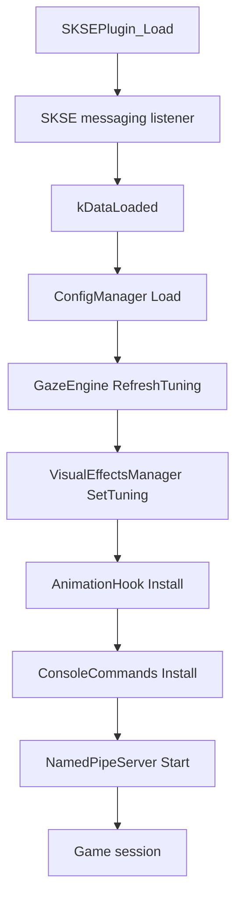
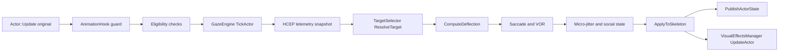
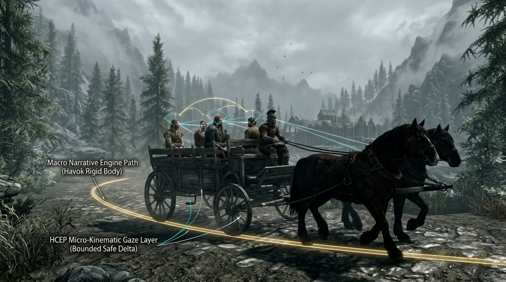

# TrueGaze Developer Guide

**Project:** TrueGaze - Biological NPC Gaze and Biomechanical Kinematics Engine
**Audience:** Contributors, engine programmers, mod authors, HCEP integrators, and release engineers
**Status date:** September 19, 2026
**Current validation runtime:** Skyrim AE `1.7.104.0`
**Primary language:** C++23/C++20-compatible project code with MSVC
**Game SDK:** CommonLibSSE-NG v7.5.4

> This guide describes the implemented repository as it exists today. It intentionally separates implemented code, standalone-tested code, and in-engine evidence. The project has real Skyrim runtime evidence for loading, actor updates, target resolution, skeleton probing, and light emitter attachment. The visible beam geometry path remains unresolved because `BSModelDB::Demand` returns `kNotExist` for the current candidate asset path.

## 1. Development Principles

### Truth states

Every capability belongs to one of four states:

| State | Meaning |
| --- | --- |
| `Designed` | Described or declared, but not implemented. |
| `Implemented` | Code exists and compiles. Runtime behavior is not yet proven. |
| `Unit-verified` | A standalone test exercises the behavior successfully. |
| `In-engine verified` | A running Skyrim instance proves the behavior. |

Do not upgrade a feature's state because a build succeeds. A build proves compilation and linkage, not scene-graph visibility, actor coverage, skeleton compatibility, or render output.

### Minimal ownership boundaries

- `ConfigManager` owns INI parsing, clamping, and effective configuration.
- `GazeEngine` owns per-actor runtime kinematics state and the main gaze pipeline.
- `TargetSelector` owns salience and target resolution.
- `PlayerGazeResolver` owns player attention and HCEP direction fusion.
- `AnimationHook` owns the post-update actor hook and safety boundary.
- `VisualEffectsManager` consumes solved gaze state and owns diagnostic emitters.
- `NamedPipeServer` owns HCEP IPC, packet validation, buffering, and feedback transport.
- `ConsoleCommands` owns vanilla-console registration and status output.
- `OarConditions` owns the evaluator/cache surface; OAR API registration is still incomplete.

Avoid duplicating decisions across these boundaries. In particular, visual code must consume the solved gaze state rather than recomputing target or kinematics math.

## 2. Repository Map

```text
src/
  Bridge/              HCEP packet definitions and named-pipe server
  Engine/              Config, gaze engine, target selection, hooks, kinematics integration
  Integrations/        Console, OAR, blink, public API integrations
  Visuals/             VisualTuning and VisualEffectsManager
include/               Public headers and exported API declarations
skyrim/                Mod-layout files copied into a release package
scripts/               Configure, build, deploy, health, launch, and package scripts
tests/                 Standalone kinematics and HCEP bridge tests
extern/CommonLibSSE-NG/ Vendored Skyrim SDK dependency
config/                Project metadata and charter files
docs/                  Audits, architecture, implementation plans, and guides
build/                 Generated CMake build trees
bin/                   Standalone test binaries
```

The `build`, `bin`, `extern`, and `vcpkg_installed` directories should not be treated as release content. Generated artifacts belong in those directories only.

## 3. Toolchain and Prerequisites

Required on the development machine:

- Windows x64.
- Visual Studio/MSVC with C++ desktop tooling.
- CMake.
- Ninja or the configured Visual Studio generator.
- vcpkg.
- CommonLibSSE-NG initialized recursively.
- Skyrim installation with matching SKSE and Address Library when doing in-engine work.

The canonical local vcpkg root used by this workspace is:

```text
D:\vcpkg
```

The repository's CMake presets provide the intended configuration. Do not create a second Python-style environment or introduce unrelated package managers for the C++ build.

## 4. Configure and Build

From the repository root:

```powershell
$env:VCPKG_ROOT = 'D:\vcpkg'
cmake --preset windows-debug
cmake --build --preset debug
```

For the release artifact:

```powershell
$env:VCPKG_ROOT = 'D:\vcpkg'
cmake --preset windows-release
cmake --build --preset release
```

The plugin output is normally:

```text
build\windows-release\Release\TrueGaze.dll
```

The debug build may also refresh the packaged project copy under:

```text
skyrim\SKSE\Plugins\TrueGaze.dll
```

The release deployment script is the preferred path because it configures before building and performs preflight checks:

```powershell
.\scripts\Deploy-TrueGaze.ps1 `
  -GamePath 'G:\Program Files (x86)\Steam\steamapps\common\Skyrim Special Edition' `
  -NoLaunch
```

Do not use `-NoBuild` after changing source unless the intended Release binary has already been rebuilt. A stale Release DLL was previously deployed while a newer Debug DLL contained the source changes.

## 5. Test Targets

### Kinematics suite

```powershell
.\bin\Debug\KinematicsTests.exe
```

The suite currently covers:

- Saccade generation.
- VOR coordination.
- Micro-jitter bounds and seeding.
- Social triangle behavior.
- Bone-controller hierarchy strain.
- Eye residual allocation.
- Main Sequence profile fidelity.
- LOD behavior.
- Blink controller behavior.
- Packet layout and CRC.
- HCEP semantic validation.

### HCEP bridge mock

```powershell
.\bin\Debug\HcepBridgeClientMock.exe
```

This starts the named-pipe server, streams telemetry frames, receives them through the engine exchange, and verifies feedback. It does not prove that a running Skyrim actor visibly moves.

### Editor diagnostics

Use the editor diagnostics on changed files, then run the narrow executable test for the changed subsystem. For changes to the plugin or visual subsystem, always perform a full CMake build before deployment.

## 6. Deployment and Binary Identity

Before launching Skyrim, compare the SHA-256 of:

```text
build\windows-release\Release\TrueGaze.dll
skyrim\SKSE\Plugins\TrueGaze.dll
<Skyrim>\Data\SKSE\Plugins\TrueGaze.dll
```

All three must match. A matching project copy is not enough if the live game install contains a stale DLL.

PowerShell check:

```powershell
Get-FileHash `
  'D:\Projects\SkyrimTrueGaze\build\windows-release\Release\TrueGaze.dll', `
  'D:\Projects\SkyrimTrueGaze\skyrim\SKSE\Plugins\TrueGaze.dll', `
  'G:\Program Files (x86)\Steam\steamapps\common\Skyrim Special Edition\Data\SKSE\Plugins\TrueGaze.dll' `
  -Algorithm SHA256
```

The deployment script intentionally preserves the existing live INI unless `-ForceIni` is used. This protects user tuning but means repository defaults are not necessarily the values active in the game.

## 7. Runtime Initialization

The S1 evidence baseline logs a runtime identity immediately after configuration load:

- plugin build date/time;
- detected game runtime version;
- effective INI path.

This fingerprint must be included in runtime acceptance reports so a stale DLL or wrong INI cannot be mistaken for a code regression.

The plugin lifecycle is approximately:



The current runtime logs establish these milestones:

- `SKSE plugin loaded successfully.`
- `Game data loaded. Initialising gaze engine.`
- `Configuration loaded ...`.
- `Gaze driver installed on Actor::Update`.
- `Gaze engine ready`.

A successful initialization log does not prove that an actor has ticked. The actor counters and skeleton probe lines are required for that conclusion.

## 8. Actor Update and Gaze Pipeline

The post-update hook is intentionally placed after Skyrim's original actor update:



### Hook boundary

`AnimationHook` deliberately calls the original Skyrim virtual function outside the TrueGaze exception guard. TrueGaze catches C++ exceptions in its own post-update work, but it does not attempt to catch access violations from Skyrim's own code.

The hook has separate paths for:

- PlayerCharacter updates.
- Character updates.
- Actor updates.

The player path is camera-aware. First-person behavior is intentionally different from third-person behavior because first-person camera control should not be overridden by NPC-style procedural head movement.

### Eligibility

The live SDK path checks:

- Non-zero FormID.
- Form lookup and actor cast.
- Loaded 3D.
- Living actor state.
- Unconscious state.
- Ragdoll state.
- Creature policy from configuration.

A hook can be installed while no actor is eligible. Use `tick calls`, `eligible ticks`, and `LOD culled` together when diagnosing this.

## 9. Target Selection

`TargetSelector::ResolveTarget` is responsible for salience, not bone motion. The selector considers, in order appropriate to the active state:

- Crosshair or player attention.
- Dialogue and social context.
- Combat context.
- Held fixation target.
- Nearby actors in the forward visual cone.
- Nearby player attention.
- Ambient forward interest.

A target record contains:

- Target FormID.
- Priority.
- World-space target position.
- Distance in meters.
- Whether the target is the player.

Target diagnostics are intentionally aggregate plus last-value state at present. When expanding diagnostics, preserve the distinction between no target, ambient interest, rejected candidate, and selected target.

## 10. Kinematics and Skeleton Application

The S2 rig-capability diagnostics classify the first successful skeleton probe as:

- `EyeNode`: at least one explicit eye node resolved;
- `GeometricHeadSocket`: head resolved but both eye nodes absent, expected on many vanilla humanoid rigs;
- `Unavailable`: no head anchor resolved.

`tgstatus` also reports cumulative eye-node-absent and head-anchor-absent counts. Eye-node absence is a supported degraded capability; head-anchor absence blocks visible pose application.

`GazeEngine::ComputeDeflection` combines:

1. HCEP telemetry when connected and fresh.
2. Skyrim-side salience.
3. Saccade generation.
4. Social triangle offsets.
5. Cognitive aversion.
6. Blink lifecycle.
7. VOR head/eye split.
8. Close-range micro-jitter.

`ApplyToSkeleton` uses cached or resolved nodes and distributes head strain across the configured hierarchy. The eye residual is the target deflection remaining after the head chain's contribution; it is not the total gaze deflection applied a second time.

Vanilla humanoid rigs may not expose separate eye nodes. The visual subsystem and skeleton code must therefore tolerate missing eye bones and derive the pupil origin from the head basis when needed.

<p align="center">
  
  <br>
  <em>Figure 1: Biomechanical hierarchical rotation distribution across cervical vertebrae (NPC Spine2 10%, NPC Neck 25%, NPC Head 65%, Ocular Vector 100%) with strict Euler angle clamping envelopes.</em>
</p>

## 11. VisualEffectsManager

The visual subsystem is a consumer of solved state. It should not call `TargetSelector` or invent a second gaze direction.

### Current light path

The light path:

- Creates `NiPointLight` objects.
- Attaches them beneath an anchor node.
- Places one at the geometric pupil origin.
- Optionally places one at the terminus.
- Applies configured colour and attenuation.
- Detaches emitters when disabled, evicted, or reset.

A `NiPointLight` is an illumination source, not a visible beam mesh. Therefore `2 lights` is not evidence of visible geometry.

### Current geometry path

The geometry path currently attempts:

- `RE::BSModelDB::Demand` to resolve a `NiNode` model.
- `NiNode::AttachChild` to attach the returned model.
- A local transform update to place, orient, and scale the model along solved gaze.

The current candidate path has returned:

```text
BSResource::ErrorCode::kNotExist
```

The latest controlled run recorded:

```text
visual updates   856
anchors failed   0
light creates failed 0
beam geometry    0 attached / 856 attempts
```

This is an asset lookup failure, not evidence that `NiNode::AttachChild` is unavailable. Do not mark the visual feature in-engine verified until the log contains a successful geometry attachment and a human observes the result in Skyrim.

### Safe visual-asset work

Preferred asset strategy:

1. Use a known Skyrim model path obtained from Skyrim's own form/model data or a reliable BSA extraction tool.
2. Validate `BSModelDB::Demand` returns `kNone` and a non-null model.
3. Attach only on the game thread.
4. Keep a strong `NiPointer` while attached.
5. Detach before releasing or replacing the parent.
6. Update world/local transforms consistently with the anchor's coordinate frame.
7. Test loading, cell transitions, save/load, and shutdown.
8. Avoid redistributing Bethesda assets in the TrueGaze package.

If a verified vanilla path cannot be resolved reliably, create an original TrueGaze NIF/texture asset and package it under the mod's own `meshes` and `textures` directories. Do not keep guessing filenames in production code.

## 12. HCEP Bridge

The bridge uses a Windows named pipe:

```text
\\.\pipe\TrueGazeBridge
```

The wire contract contains:

- 64-byte inbound telemetry packets.
- 32-byte outbound feedback packets.
- Magic and version fields.
- Sequence and timestamp data.
- Gaze pitch/yaw, convergence, and confidence.
- HCEP mode and cognitive state.
- Blink and social state.
- Active target and feedback data.
- CRC validation and semantic validation.

<p align="center">
  
  <br>
  <em>Figure 2: Real-world face/eye tracking streamed through the local named pipe into Skyrim's skeletal transform pipeline.</em>
</p>

The implementation uses asynchronous worker activity and a triple-buffered exchange. Keep game-thread work non-blocking. Do not read or write the pipe handle directly from the game thread when the worker owns it; use the existing outbound queue/accessor pattern.

HCEP telemetry should be treated as optional, stale data should be rejected, and local biometric data handling must remain consistent with `LICENSE` and `GOVERNANCE.md`.

### S4 fusion semantics (implemented)

`PlayerGazeResolver` applies the fusion policy before any HCEP vector reaches the crosshair ray:

1. **Semantic validation** — `ValidateTelemetryPacket` rejects NaN, out-of-range angles, invalid modes, and reserved-field violations.
2. **Confidence gate** — below 0.5 confidence the vector is not fused.
3. **Staleness gate** — telemetry older than 500 ms is treated as absent.
4. **Blink suppression** — with both eyes closed the vector is a prediction, not an observation; fusion is suppressed.
5. **Convergence plausibility** — focal distance outside 0.3-6.0 m is flagged, not silently trusted.

`LastIntent()` exposes the current fusion state; `tgstatus` prints it so a support report can answer why fusion is inactive without a debugger.

### 12.2 Scripted Scenes & Meta-Controller Architecture

During highly scripted sequences—most critically the opening carriage ride (`MQ101`) approaching Helgen—standard autonomous gaze plugins risk destabilizing Havok physics rigid bodies or overriding bespoke dialogue look-ats. TrueGaze addresses this by operating as a **Meta-Controller**:

- **Macro Narrative Invariance:** The Skyrim quest engine retains 100% authority over actor navigation, furniture bindings, and root translations ($\Delta T = 0$).
- **Micro-Kinematic Modulation:** TrueGaze injects additive angular deltas ($\Delta \mathbf{R}$) across cervical and ocular nodes, applying non-linear hyperbolic tangent strain clamping ($\theta_{\text{eff}} = \theta_{\text{max}} \tanh(\theta / \theta_{\text{max}})$).
- **Havok Zero-Taint:** Rotational deltas are fully withdrawn between animation frames, guaranteeing zero Havok cart rollover or physics explosions.

<p align="center">
  
  <br>
  <em>Figure 3: Dual-layer Meta-Controller architecture during the Helgen cart sequence (MQ101)—preserving the macro narrative Havok path while modulating micro-kinematic gaze vectors without physics instability.</em>
</p>

For full mathematical derivations, packet structures, and dialogue sentiment parsing rules, see [`docs/HCEP_META_CONTROLLER_SPEC.md`](HCEP_META_CONTROLLER_SPEC.md).

## 13. Console Diagnostics

`CmdStatus` is a development instrument, not a substitute for structured telemetry. It currently reports:

- Effective configuration switches.
- Runtime actor counters.
- Last target fields.
- Visual lifecycle counters.
- Geometry attempts and attachment count.
- Command registration state.

When adding diagnostics:

- Use bounded or first-occurrence logging.
- Include the actor FormID and relevant stage.
- Distinguish failure from absence of work.
- Avoid logging every actor every frame.
- Make the console output useful without requiring source access.

## 14. Configuration and Reload Semantics

`ConfigManager::Load` reads the deployed INI and sanitizes values. `GazeEngine::RefreshTuning` snapshots the values into engine and visual tuning structures.

When changing a configuration key:

1. Add or update the field in `ConfigManager.hpp`.
2. Parse it in `ConfigManager.cpp`.
3. Clamp it in `Sanitise()` when applicable.
4. Copy it into the immutable runtime tuning snapshot.
5. Consume it at the owning subsystem.
6. Add or update HTML configurator schema and tooltip metadata.
7. Update the shipped INI.
8. Add a test if the value affects math, packet semantics, or a public contract.
9. Verify live logs show the effective value.

Do not assume the repository INI is the live INI. Deployment preserves user configuration by design.

## 15. Packaging

The package script is:

```powershell
.\scripts\PackageMod.ps1
```

The package must contain only intended mod-layout files. Do not include:

- `build/` directories.
- `bin/` test outputs.
- Intermediate `.obj`, `.ilk`, or generated CMake files.
- Private logs or save files.
- Bethesda-owned NIF or texture assets copied into the repository.
- Development-only credentials or machine paths.

The package currently remains a release candidate. A public 1.0 release requires visible-effects verification, clean-profile testing, documentation alignment, and a final package audit.

## 16. Release Validation Checklist

### Build and tests

- [ ] Configure succeeds from a clean or known-good checkout.
- [ ] Release build succeeds.
- [ ] `KinematicsTests.exe` passes all suites.
- [ ] `HcepBridgeClientMock.exe` passes.
- [ ] Editor diagnostics report no relevant errors.

### Binary and install

- [ ] Release, packaged, and live DLL hashes match.
- [ ] SKSE runtime and Address Library match the target Skyrim runtime.
- [ ] Preflight health check passes.
- [ ] No stale legacy MCM/Papyrus artifacts are introduced.

### In-engine

- [ ] Plugin load appears in `skse64.log` and `TrueGaze.log`.
- [ ] Actor hook invocation is observed.
- [ ] Eligible actor ticks are observed.
- [ ] Target resolutions are observed.
- [ ] Skeleton probe is recorded.
- [ ] Bone behavior is observed in a real actor.
- [ ] Visible illustration geometry or effect is attached and observed.
- [ ] Save/load and cell transition are tested.
- [ ] No new crash, shutdown hang, or repeated exception is observed.

### Documentation and legal

- [ ] README and STATUS reflect actual evidence.
- [ ] User and developer guides are included.
- [ ] CHANGELOG describes only completed work.
- [ ] License and SDK/public API claims are consistent.
- [ ] Biometric privacy notice is visible and accurate.
- [ ] Bethesda assets are not redistributed.

## 17. Contribution Workflow

1. Read `AGENTIC_PRIME_DIRECTIVE.md`, `GOVERNANCE.md`, and the relevant status/audit documents.
2. Identify the owning abstraction before editing.
3. State one falsifiable hypothesis and one cheap check.
4. Make the smallest local edit.
5. Run the narrowest executable validation immediately.
6. Build the affected target.
7. Run standalone tests and preflight checks.
8. For runtime changes, deploy only after binary identity verification.
9. Record new evidence in the appropriate status or audit document.
10. Do not claim in-engine verification without a real Skyrim run and log evidence.

## 18. Useful Commands

```powershell
# Configure and build debug
$env:VCPKG_ROOT = 'D:\vcpkg'
cmake --preset windows-debug
cmake --build --preset debug

# Build, deploy, and preflight release without launching
.\scripts\Deploy-TrueGaze.ps1 `
  -GamePath 'G:\Program Files (x86)\Steam\steamapps\common\Skyrim Special Edition' `
  -NoLaunch

# Post-run health analysis
.\scripts\Test-TrueGazeHealth.ps1 `
  -GamePath 'G:\Program Files (x86)\Steam\steamapps\common\Skyrim Special Edition' `
  -PostRun

# Standalone validation
.\bin\Debug\KinematicsTests.exe
.\bin\Debug\HcepBridgeClientMock.exe
```

## 19. Current Open Work

The asset-reuse research and support decision tree are maintained in [`TRUEGAZE_SUPPORT_KNOWLEDGE_BASE.md`](TRUEGAZE_SUPPORT_KNOWLEDGE_BASE.md). Use that document before changing resource paths or attaching another guessed NIF.

The highest-priority open work is the visible in-game illustration asset:

1. Obtain an exact, verified Skyrim resource path from model/form data or a reliable BSA tool.
2. Confirm `BSModelDB::Demand` resolves it.
3. Confirm `NiNode::AttachChild` succeeds on the game thread.
4. Confirm the model is visible and correctly oriented.
5. Tune origin, axis, scale, colour, opacity, and length.
6. Package only original assets, or rely on the user's existing Skyrim archives without redistributing Bethesda content.

After that, the next release work is documentation/status correction, clean-profile verification, packaging audit, and final publication review.
