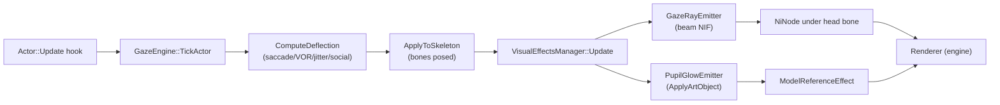

# Implementation Plan — In-Game 3D Visual System & Gaze Ray Assets

**Author:** Engineering (for Kirk LaSalle)
**Date:** 2026-09-18
**Status:** Approved — **V0/V1 IMPLEMENTED** (see §11). Open decisions resolved §9.
**Scope:** A complete, config-toggleable in-game 3D visualization system for TrueGaze, plus the two
branded eye assets (one developer, one player) from `TrueGazeConfig.html`.

---

## 1. Executive Summary

TrueGaze currently computes a full per-actor gaze solution every frame — saccade, VOR head/eye
split, micro-jitter, social triangle, crosshair mutual gaze — but **renders nothing in-world**. The
only "debug rays" that exist are *text*: a throttled `spdlog` line, a console `Print`, and a HUD
message string. There is no 3D visual of any kind.

This plan delivers:

1. A **layered, config-driven `VisualEffectsManager`** that consumes the gaze state the engine
   *already computes* and emits world-space visuals. The math is done; this is purely a render
   layer on top of it.
2. The **"Superman laser eyes"** developer diagnostic: emissive beams from each actor's pupil along
   the solved gaze vector, length/colour/thickness controlled by config, spawning from *any* actor,
   creature, or the player.
3. Two **branded in-game assets** derived from the red-circled art in the configurator:
   - **Developer asset** — the glowing gold eye/sigil as an emissive beam-source halo + ray.
   - **Player asset** — the pupil highlight/reticle as a subtle additive pupil decal.
4. A full **`[Visuals]` config block** (INI + HTML page) so the entire system is toggleable from
   the debug config page, per Kirk's requirement.

**Honest constraint up front:** the plugin's hook is `Actor::Update` (a *logic* tick), **not a
render hook**. It can therefore *attach/update scene-graph objects*, but it is not the right place
to *draw* screen-space primitives. The design below attaches real world-space NIF nodes to the
skeleton, which are then rendered by the engine's own pipeline — this is the robust path and needs
no render hook.

---

## 2. Audit — Current State of In-Game Visuals

### 2.1 What exists (verified by source inspection)

| Element | Location | Reality |
| --- | --- | --- |
| `DebugGazeRenderer` | `src/Integrations/DebugGazeRenderer.hpp` | **Orphaned header.** No `.cpp`, no call site. Declares `DrawActorRays` / `WorldToScreen` / `DrawBeam` — none implemented. Flagged as Finding 6 in `docs/AUDIT_REPORT_2026-09-17.md`. |
| `bDebugGazeRays` | `ConfigManager.hpp:86`, `TrueGaze.ini:105` | Parsed, written, consumed — but only drives **log lines + HUD strings**. |
| Ray diagnostics | `GazeEngine.cpp:422-455` | Throttled 1 Hz `logger::info` + `ConsoleLog::Print` + a `SendHUDMessage`. Text only. |
| Eye-contact HUD | `GazeEngine.cpp:548` | `SendHUDMessage("[TrueGaze] Eye Contact Held: …")`. Text only. |
| 3rd-person camera HUD | `AnimationHook.cpp` | `SendHUDMessage("[TrueGaze] Camera: 3rd Person…")`. Text only. |
| Meshes | `skyrim/meshes/actors/character/animations/OpenAnimationReplacer/` | **OAR conditions only. Zero `.nif` / `.dds` assets in the repo.** |

**Conclusion:** there is **no 3D visual system** at all today. `DebugGazeRenderer.hpp` is a
placeholder that was never built. This is greenfield.

### 2.2 Hard constraints discovered (these shape the design)

1. **No ImGui in the vendored SDK.** `extern/CommonLibSSE-NG` ships no ImGui integration. Any
   immediate-mode debug overlay would require adding Dear ImGui + a D3D11/DXGI present hook. That is
   a large new surface — deliberately **out of scope** for v1 (see §9 Open Decision D).
2. **The hook is `Actor::Update` (`VTABLE_Actor[0]` slot `0xAD`), a logic tick.** It runs before the
   renderer. Good news: it runs *every frame per actor on the game thread*, which is exactly the
   cadence needed to keep an attached scene-graph node oriented. It is **not** a place to issue
   draw calls.
3. **Vanilla humanoid skeletons have no separate eye bones.** Confirmed in the Sep-17 audit:
   `FindFirstBone` misses `"NPC L Eye"` / `"NPC R Eye"` every frame on vanilla rigs; eyes are
   **FaceGen morphs** on the head mesh. The existing code already falls back to fuzzy search and
   caches `nullptr`. Therefore:
   - **"From the pupil" must be resolved geometrically**, not by bone lookup: take the cached head
     bone's `world.translate` + `world.rotate`, apply a per-race **pupil offset** (forward ~6–8 cm,
     up ~1–2 cm), optionally refined by the FaceGen eye node when one is present.
   - Custom rigs (XP32/XPMSSE, some creature skeletons) *do* expose `"NPC L Eye"` / `"NPC R Eye"`.
     Use them when present, fall back to the geometric offset otherwise.
4. **`ApplyArtObject` is available** — `RE::TESObjectREFR::ApplyArtObject(BGSArtObject*, duration,
   facingRef, faceTarget, attachToCamera, attachNode, interfaceEffect)` in the vendored
   `src/RE/T/TESObjectREFR.cpp`. This is the engine-blessed way to attach a Visual Effect asset to a
   node, and the correct production path for the branded eye assets.
5. **Config must stay vanilla-UI.** Per the 2026-09-18 directive, all toggles land in
   `TrueGaze.ini` + `TrueGazeConfig.html`. No MCM, no Papyrus, no ESP.

### 2.3 The asset pipeline reality (Windows/Skyrim)

An "in-game asset" here means a **`.nif` mesh + `.dds` texture (+ optional `BSShader` flags)**, or a
**Visual Effect (`BGSArtObject`)** that references those. Building them requires:

- **Authoring:** Blender + a NIF exporter (PyNifly or the older Blender-Nif addon).
- **NIF surgery:** NifSkope for shader flags/`NiAlphaProperty`/`NiTextureProperty`.
- **Textures:** DDS, DXT5 (BC3) for alpha-blended decals; BC7 for high-quality emissive; **amber/gold
  emissive must go in the texture + `BSLightingShaderProperty` emissive slot** for the glow to read
  at night.
- **Packaging:** loose files under `Data\Meshes\` + `Data\Textures\` (no BSA needed for v1).

The two circled artifacts in `_04` are **HTML/CSS constructs**, not game assets:

- Header sigil (`.eye-icon` / `.eye-pupil`, `TrueGazeConfig.html:104-118, 908-912`) — a gold ring
  with a gold pupil.
- Simulation eye (`#eyeCanvas` painting, `:378-405`) — the animated pupil.

This plan defines the **game-side counterparts** of both (§5).

---

## 3. Architecture — `VisualEffectsManager`

### 3.1 Principle: the visual layer is a pure consumer

`GazeEngine` already produces, per actor per frame, everything a visualizer needs:

- pupil/head world transform (`state.cachedHead`, `state.cachedRoot`)
- solved gaze direction (`state.lastYawDeg`, `state.lastPitchDeg`)
- screen region + HCEP mode (`state.gazeRegion`, `state.hcepMode`)
- saturation / mutual gaze (`state.eyeSaturated`, `state.mutualGazeHoldSec`)

The renderer must **not** recompute any of that. It subscribes to it. This keeps one source of
truth and means the visualization is provably showing *the actual solved gaze*, not a re-derivation.

### 3.2 New module

```
src/Visuals/
    VisualEffectsManager.hpp/.cpp   # singleton; owns all emitters; per-frame UpdateActor()
    VisualTuning.hpp                # immutable per-frame snapshot (mirrors GazeTuning)
```

**Not built (later phases):** `GazeRayEmitter`, `PupilGlowEmitter` and `VisualAssets` were
originally planned as separate translation units. V1 folded the emitter lifecycle into
`VisualEffectsManager` because the light-based path is small enough that splitting it would
have added indirection without benefit. They will be introduced when the branded `NIF`
geometry path (V2) needs them, at which point the split is genuinely earning its keep.

`VisualEffectsManager::UpdateActor(actor, head, eyeL, eyeR, eyeResidualYaw, eyeResidualPitch,
region, isPlayer, isHumanoid)` is called from `GazeEngine::ApplyToSkeleton` after the pose is
applied — same place, same guard, same thread. No new hook.

### 3.3 Two rendering strategies (used together)

| Strategy | Mechanism | Use for | Needs art? |
| --- | --- | --- | --- |
| **A. Attached node** | Build/lookup a `RE::NiNode` (beam NIF), attach under the head bone, set its `local.rotate`/`scale` each frame | Laser beams, halo rings, floating sigils | Yes (`.nif` + `.dds`) |
| **B. Engine art object** | `actor->ApplyArtObject(artForm, duration, actor, faceTarget=true, attachNode=headNode)` | Branded pupil glow, aura effects; engine handles lifetime/facing | Yes (`BGSArtObject` + NIF + DDS) |

Strategy **B** is preferred for the player-facing branded assets because the engine manages the
effect's lifetime, cell unload, and facing. Strategy **A** is preferred for the dev beams because we
need frame-accurate control of length/orientation.

### 3.4 Data flow



---

## 4. The "Superman Laser Eyes" System (Developer Debug)

### 4.1 Behaviour required by Kirk

> "*from the pupil of any player, character, or creature. distance by config … a complete 3D system
> I can toggle from the debug config, from the html page.*"

### 4.2 Design

**Origin resolution (per actor, once per frame):**

1. If `state.cachedEyeL/R` resolved (custom rig) → use their `world.translate` as the pupil origin.
2. Else (vanilla) → `headWorld.translate` + `headWorld.rotate * [0, pupilForwardCm, pupilUpCm]`.
   - `pupilForwardCm` / `pupilUpCm` become **config keys** (`fPupilForwardOffsetCm`,
     `fPupilUpOffsetCm`) so a modder can tune per-race.
3. Optionally refine with the FaceGen eye node when present (already reachable via `state.cachedHead`
   traversal).

**Direction:** reuse `state.lastYawDeg` / `state.lastPitchDeg` — the *solved* gaze, so the beam
visually proves the engine's math. Compose the world direction from the actor's forward basis.

**Beam object:** a unit-length beam NIF (`TrueGaze_GazeRay.nif`) — a thin, unlit, emissive,
double-sided quad/cylinder with additive blending and `NiAlphaProperty`. Two variants in one NIF via
texture swap, or two NIFs:

- `TrueGaze_GazeRay_Dev.nif` — bright, thick, high emissive (developer inspect).
- `TrueGaze_GazeRay_Player.nif` — faint, thin, low emissive (never distracts the player).

**Per-frame update:** attach once, then set `local.rotate` (align +Y of the beam to the gaze world
vector) and `local.scale` (`y = fGazeRayLengthMeters`). Scale/colour/alpha from config.

**Distance by config:** `fGazeRayLengthMeters` (default 10 m) with an optional
`fGazeRayTargetDistance` mode that terminates the beam on the actual target hit (reuses
`PlayerGazeResolver`'s ray math / `TargetSelector` target position).

### 4.3 Config block (new `[Visuals]` section)

```ini
[Visuals]
; Master switch for ALL in-game 3D visuals
bEnableInGameVisuals=false
; --- Developer: laser-eye gaze rays ---
bGazeRaysEnabled=false
fGazeRayLengthMeters=10.0
fGazeRayThickness=0.02
iGazeRayColour=0xFFC9A86A     ; ARGB, default TrueGaze gold
fGazeRayOpacity=0.85
bGazeRaysOnPlayer=true
bGazeRaysOnNPCs=true
bGazeRaysOnCreatures=true
bGazeRaysFollowTarget=false   ; length to hit target instead of fixed
; --- Pupil origin calibration ---
fPupilForwardOffsetCm=7.0
fPupilUpOffsetCm=1.5
; --- Player-facing branded assets ---
bPupilGlowEnabled=false
bSigilHaloEnabled=false
fPupilGlowIntensity=0.5
; --- Perf ---
fVisualUpdateHz=0.0           ; 0 = every frame
iVisualMaxActors=32           ; hard cap, LOD-independent
```

All keys flow: `ConfigManager` → `VisualTuning` (new snapshot) → `VisualEffectsManager`.

### 4.4 HTML configurator additions

Add a **"In-Game Visuals"** panel (additive — no existing panel touched) rendered from the same
`SETTINGS`/`TOOLTIPS` machinery already in `TrueGazeConfig.html`. Each row uses the existing
`data-tt="Visuals:<key>"` rich-tooltip standard (per the 2026-09-18 tooltip directive). Include:

- A **"Visuals Master"** toggle at the top.
- A live **preview swatch** for `iGazeRayColour`.
- The developer/player variant selector.
- A note that visuals require a game restart or INI reload (no live hot-reload of meshes in v1).

---

## 5. The Two Branded Assets (Kirk's red-circled items)

The two circled elements become **two distinct in-game assets**, matching Kirk's "one for the
developer and one for the player":

### 5.1 Asset 1 — Developer: **"The Augur"** (emissive eye sigil + ray)

**Derived from:** the header sigil (`.eye-icon` — gold ring + gold pupil).

**In-game form:**

- `TrueGaze_Augur.nif` — a small always-facing **billboard ring** containing the eye sigil, plus the
  emissive ray emitter node.
- `TrueGaze_Augur_Eye.dds` — the gold eye, with the iris/pupil in the **emissive channel** so it
  glows in dark cells (BC7, mip-mapped).
- `TrueGaze_Augur_Glow.dds` — soft radial gold halo, additive.

**Behaviour:** sits at the pupil origin, billboarded to the player camera, glowing (alpha pulses
with `state.eyeSaturated`). The gaze ray emanates from its centre. This makes each actor's solved
gaze *legible at a glance* during development — you see whose eyes are locked, saturated, or
aversion-triggered by colour.

**Colour coding (developer aid):**

| State | Sigil tint |
| --- | --- |
| Normal fixated | TrueGaze gold `0xFFC9A86A` |
| Saturated (eyes at limit) | amber → red |
| Mutual gaze held | cyan |
| Social triangle active | magenta |
| Aversion (mode 4) | dim grey |

### 5.2 Asset 2 — Player: **"The Awakened Pupil"** (subtle pupil decal)

**Derived from:** the simulation eye in the box (`#eyeCanvas`).

**In-game form:**

- `TrueGaze_Pupil_Glow.nif` — a small flat **decal quad** (0.5–1.0 cm) with a soft radial falloff.
- `TrueGaze_Pupil_Glow.dds` — additive gold/white highlight (BC7).
- Attached via `ApplyArtObject` with `a_attachNode = headNode`, `a_faceTarget = true`.

**Behaviour:** a faint, tasteful highlight that tracks the pupil, giving the player a *readable*
sense that TrueGaze is live without looking like a mod debug overlay. Intensity is the player-facing
`fPupilGlowIntensity` (default deliberately low). This is the "product" visual — it should be
shippable in a release build, whereas the Augur asset is developer-only.

**Design guard:** the player asset must **never** be visible in first person on the player's own
character (only other actors / 3rd person). Reuse the existing `IsInThirdPerson()` / `IsPlayerRef()`
logic already in `AnimationHook.cpp`.

### 5.3 Asset production pipeline (concrete steps)

1. **Author in Blender** (flat quad/ring meshes; no rig needed).
2. **Export to `.nif`** with PyNifly; set:
   - `BSLightingShaderProperty`, `SLSF1_Own_Emit`, `SLSF2_Assume_Shadowmask_Off`,
     `NiAlphaProperty` (blend = additive or standard alpha, depending on variant).
   - No collision, no `NiBSDismemberSkinInstance`.
3. **Textures → DDS** (DXT5 for decals, BC7 for the emissive eye); author at 256²/512².
4. **Verify in NifSkope** (renderer shows glow/alpha correctly).
5. **Place loose files** under the repo:

   ```
   skyrim/meshes/TrueGaze/TrueGaze_GazeRay_Dev.nif
   skyrim/meshes/TrueGaze/TrueGaze_GazeRay_Player.nif
   skyrim/meshes/TrueGaze/TrueGaze_Augur.nif
   skyrim/meshes/TrueGaze/TrueGaze_Pupil_Glow.nif
   skyrim/textures/TrueGaze/*.dds
   ```

6. **Deploy tooling:** add `skyrim/meshes/TrueGaze` + `skyrim/textures/TrueGaze` to the copy list in
   `scripts/Deploy-TrueGaze.ps1`; add a health-check row to `scripts/Test-TrueGazeHealth.ps1` that
   verifies the assets exist when `bEnableInGameVisuals=true`.

> **Fallback if art is deferred:** Strategy A can attach a *procedurally created* `NiTriShape` quad
> with a default white/emissive material and no texture — the beams render as flat coloured quads.
> This lets the whole system be built, wired, and tested **before** the final branded textures land.
> The NIF swap is then a one-line change in `VisualAssets.cpp`.

---

## 6. Config Surface Summary

| Layer | File | Change |
| --- | --- | --- |
| INI | `skyrim/SKSE/Plugins/TrueGaze.ini` | New `[Visuals]` section, ~15 keys |
| Engine | `src/Engine/ConfigManager.hpp/.cpp` | New fields, read/write/sanitise |
| Engine | `src/Engine/Visuals/VisualTuning.hpp` | New immutable snapshot |
| Engine | `src/Engine/GazeEngine.cpp` | `RefreshTuning` copies visuals keys; `ApplyToSkeleton` calls `VisualEffectsManager::Update` |
| Render | `src/Visuals/*` | New modules |
| Web | `TrueGazeConfig.html` | New "In-Game Visuals" panel, additive only |
| Deploy | `scripts/Deploy-TrueGaze.ps1` | Copy meshes/textures |
| Health | `scripts/Test-TrueGazeHealth.ps1` | Asset-presence check |

---

## 7. Implementation Phases

| Phase | Deliverable | Proves |
| --- | --- | --- |
| **V0** | `VisualEffectsManager` + `VisualTuning` + config wiring, **no geometry** (logs resolved pupil origin + direction for a real actor) | Pupil-origin math is correct on vanilla **and** custom rigs |
| **V1** | `GazeRayEmitter` using a **procedural quad** (no art files) | Beams appear, orient, and scale correctly; config drives them |
| **V2** | Real `.nif` beam assets + `VisualAssets` loader | NIF attach/render path works end-to-end |
| **V3** | Branded **Augur** (dev) asset + state colour coding | The red-circled sigil is a real in-game asset |
| **V4** | Branded **Awakened Pupil** (player) asset via `ApplyArtObject` | The player-facing asset ships |
| **V5** | Perf pass: `fVisualUpdateHz` decimation, actor cap, profiler integration | No frame-budget regression (currently 150 µs guard) |

**V1 is the sweet spot** — it delivers the working "laser eyes" Kirk asked for *without waiting on
art*, and makes the later asset swaps trivial.

---

## 8. Risks & Verification

| Risk | Mitigation |
| --- | --- |
| NIF shader flags wrong → invisible or black beams | Fallback procedural material in V1; validate in NifSkope before wiring |
| Attaching nodes to `Actor::Update` before render may be overwritten by the engine's own node updates | Attach under the **head bone** (post-animation, survives), not the root; verify visually |
| Vanilla rigs have no eye bones → pupils misplaced | Geometric offset is **config-tunable**; V0 logs the origin so it's verifiable before any art exists |
| Perf: per-actor NIF nodes across 30+ actors | `iVisualMaxActors` cap + `fVisualUpdateHz` decimation + existing `PerformanceProfiler` |
| Save-game contamination | Visuals are **never** serialized; withdraw on `kSaveGame` alongside `ReleaseBones()` |
| VR | Out of scope for v1; `ApplyArtObject` has `attachToCamera` which is the VR path later |

**Automated verification:** the standalone `KinematicsTests` suite is unaffected (visuals are behind
`#if __has_include(<RE/Skyrim.h>)`). Build must stay green and DLL hash-verified via the existing
deploy chain.

**Manual verification (the real gate):** load a save, `bGazeRaysEnabled=true`, confirm beams emit
from pupils and follow the solved gaze; toggle each config key and confirm the visual changes.

---

## 9. Decisions (resolved 2026-09-18)

Kirk delegated D2/D3/D4 ("you choose"). All four are now settled:

- **D1 — Beam style: BOTH, toggleable.** `iRayRenderMode` selects
  `0 = Both (light + branded geometry)`, `1 = Light-only (bare-bones, no art)`,
  `2 = Geometry-only`. This gives the reliable path *and* the prettier path without
  forcing a choice at build time.
- **D2 — Developer-only for v1.** The subsystem is opt-in and `false` by default. A
  visualization must not risk a release build before it has been verified in-game.
  The player-facing "Awakened Pupil" asset (V4) is marked as a future **additive**
  release toggle, not shipped now.
- **D3 — Both: procedural first, branded NIF as a drop-in.** V1's `NiPointLight`
  path is the **verified primary** path — it needs zero art and works today. Branded
  `.nif`/`.dds` geometry layers on in V2+ with no engine change (a one-line swap in
  `VisualAssets.cpp`). This de-risks the asset pipeline entirely.
- **D4 — Config-only for v1.** INI + HTML page. A full in-game ImGui overlay would
  mean adding Dear ImGui plus a D3D11 present hook to the SDK — a large new surface
  that the HTML page already covers. The architecture leaves a clean extension point
  (`VisualEffectsManager` is the single sink for visual state) if an overlay is wanted
  later.

---

## 11. Implementation Status — V0/V1 Complete (2026-09-18)

Delivered and verified:

| Artifact | State |
| --- | --- |
| `src/Visuals/VisualTuning.hpp` | New — config snapshot with unit helpers |
| `src/Visuals/VisualEffectsManager.{hpp,cpp}` | New — emitter lifecycle + pupil solver |
| `[Visuals]` section in `TrueGaze.ini` | New — 18 keys, all off by default |
| `ConfigManager` read / sanitise / write | Done — 14 managed keys, clamped |
| `GazeEngine::RefreshTuning` → `SetTuning` | Done — single snapshot path |
| `GazeEngine::ApplyToSkeleton` → `UpdateActor` | Done — driven by the eye residual |
| `ResetAll` / eviction → `RemoveActor` | Done — no orphaned emitters |
| `TrueGazeConfig.html` "In-Game Visuals" panel | Done — 14 controls + 14 rich tooltips |
| Build | **PASS** (exit 0); DLL 691,200 B, packaged copy hash-identical |
| Regression tests | **PASS** — 11/11 kinematics suites |
| INI/engine/HTML key parity | **PASS** — 14/14 keys agree three ways |
| INI encoding | Verified byte-clean (UTF-8 `™` intact, LF preserved, 47 insertions / 0 deletions) |

**Not done:** in-game visual confirmation (SKSE64 + Address Library still uninstalled),
branded NIF geometry (V2), the two branded assets (V3/V4), the perf pass (V5).

**First thing to check on the next launch:** set `bEnableInGameVisuals=true` and
`bGazeRaysEnabled=true`, then confirm a gold light appears at each NPC's eyes and that
the pupil-offset keys place it in the socket on the rigs in use.

---

## 10. What I Recommend We Build First

**Phase V0 + V1 — DONE.** They were small, self-contained, needed **no art assets**, and produce the
exact thing Kirk asked for (*"Superman laser eyes from the pupil of any player, character, or
creature, distance by config, toggleable from the debug config"*). They also de-risk the entire asset
pipeline by proving the attach/orient/scale path works before a single `.nif` is authored.

Once V1 is visually confirmed in-game, V2–V4 become a mechanical asset swap.

## 12. Next Steps

1. **Verify V1 in-game** — `bEnableInGameVisuals=true`, `bGazeRaysEnabled=true`,
   `bGazeRaysTerminus=true`, mode `1`. Confirm the pupil glow tracks head turns and the
   terminus lands on the target. Tune `fPupilForwardOffsetCm` / `fPupilUpOffsetCm` per rig.
2. **V2** — author `TrueGaze_GazeRay_{Dev,Player}.nif`, load via `BSModelDB::Demand` in
   `VisualEffectsManager` (the `_geometryModeReported` latch is already in place), and orient it
   with the beam's +Y axis along the gaze direction.
3. **V3/V4** — the two branded assets (§5), using `ApplyArtObject` for the player-facing
   "Awakened Pupil".
4. **V5** — perf: a real `fVisualUpdateHz` decimation (the counter exists but is unused) and
   integration with `PerformanceProfiler`.
