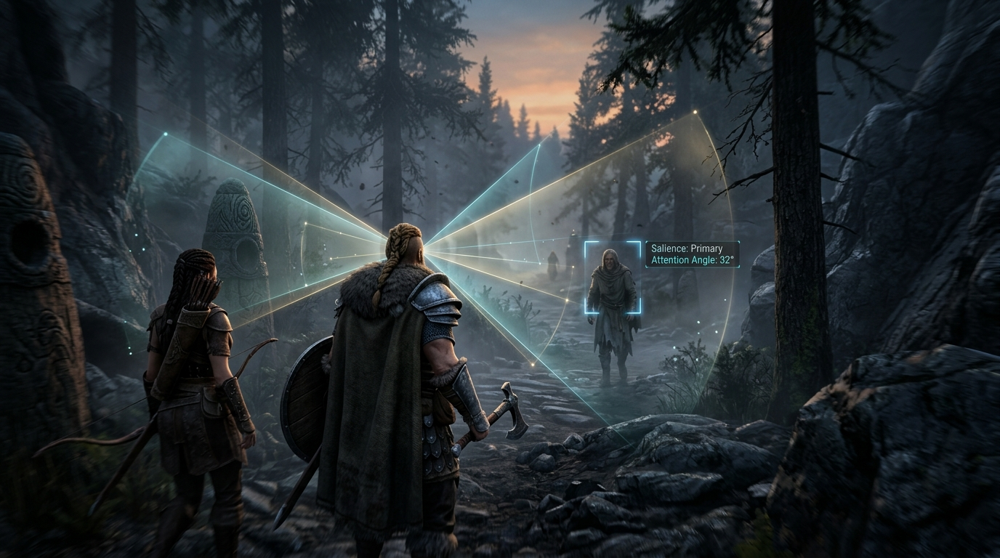
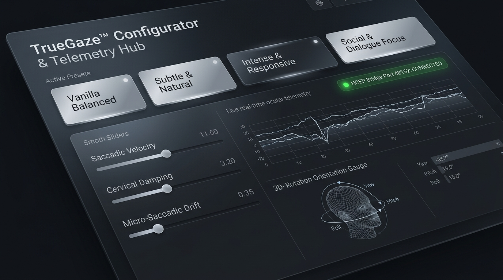

# TrueGaze User Guide

**Product:** TrueGaze - Biological NPC Gaze and Biomechanical Kinematics Engine
**Audience:** Skyrim SE/AE/VR players, mod testers, and development partners
**Status date:** September 19, 2026
**Current release line:** 1.0.0-rc1 development build

> TrueGaze is an active development project. The core plugin, actor update path, target resolution, skeleton probing, configuration, and runtime diagnostics have been exercised in a real Skyrim AE session. The optional visible 3D illustration beam remains under development: the current runtime can attach light emitters, but the beam geometry asset has not yet loaded successfully in the tested installation.

## 1. What TrueGaze Does

TrueGaze is an SKSE plugin that drives an actor gaze simulation from Skyrim's actor update path. It combines target salience, saccadic movement, eye/head coordination, micro-saccadic drift, social attention, and optional HCEP telemetry.

The current runtime can:

- Track eligible living actors.
- Resolve a target from dialogue, combat, proximity, crosshair attention, or ambient interest.
- Apply hierarchical gaze motion through the available skeleton nodes.
- Use configurable saccade, VOR, comfort, jitter, social, and LOD parameters.
- Receive optional HCEP telemetry through a Windows named pipe.
- Report actor, target, skeleton, visual, and performance diagnostics through the Skyrim log and `tgstatus`.

The optional Visuals subsystem is a developer diagnostic. It is not required for the gaze simulation itself.

<p align="center">
  
  <br>
  <em>Figure 1: In-engine target salience and perception field-of-view cones tracking environmental focal points and conversational targets in third-person view.</em>
</p>

## 2. Requirements

### Skyrim and runtime

- Skyrim Special Edition or Anniversary Edition supported by the installed CommonLib/SKSE build.
- The current development validation target is Skyrim AE runtime `1.7.104.0`.
- Matching SKSE runtime, currently `skse64_1_7_104.dll` for the validation machine.
- Matching Address Library file, currently `versionlib-1-7-104-0.bin`.
- Windows x64.

### Plugin prerequisites

- SKSE64.
- Address Library for SKSE Plugins.
- Microsoft Visual C++ 2015-2022 x64 runtime.
- A working Skyrim Data directory.

TrueGaze does not require SkyUI, MCM Helper, an ESP/ESL plugin, Papyrus scripts, or an in-game MCM menu. Configuration is intentionally vanilla-UI and INI-based.

## 3. Installation Layout

A normal installation places the plugin at:

```text
Skyrim Special Edition\Data\SKSE\Plugins\TrueGaze.dll
Skyrim Special Edition\Data\SKSE\Plugins\TrueGaze.ini
```

The repository package also contains the standalone configurator:

```text
TrueGazeConfig.html
Launch-TrueGazeConfig.cmd
```

Do not place the DLL beside `SkyrimSE.exe`. SKSE plugins belong under `Data\SKSE\Plugins`.

## 4. First Launch

1. Install SKSE and the matching Address Library.
2. Install `TrueGaze.dll` and `TrueGaze.ini`.
3. Start Skyrim through the SKSE loader.
4. Load an existing save or start a new game. A new game is not required.
5. Load into a cell containing a living humanoid NPC.
6. Switch to third-person view when testing player-attached visuals.
7. Wait several seconds for actor updates.
8. Open the vanilla console with `~`.
9. Run `tgstatus` if console commands are enabled.

A save reload or cell transition can rebuild actor 3D nodes, but neither is normally required. A new game does not solve a missing asset, a bad deployment, or an incorrect resource path.

## 5. Configurator Workflow

Launch `Launch-TrueGazeConfig.cmd` or open `TrueGazeConfig.html` through the repository's launcher.

The configurator can:

- Detect the Skyrim installation.
- Inspect saves and the current hero.
- Read and edit `TrueGaze.ini`.
- Apply quick presets.
- Show the selected preset with a silver active state.
- Display the current deployment and engine status.
- Save changes back to the live INI through the local automation bridge.

The top status cards use a classic Skyrim silver treatment. This is visual configurator styling only; it does not alter in-game rendering.

<p align="center">
  
  <br>
  <em>Figure 2: The standalone TrueGaze Configurator & Telemetry Hub interface with active silver presets and real-time ocular tracking diagnostics.</em>
</p>

### Presets

The built-in presets are tuning starting points, not separate engines:

- **Vanilla Balanced:** baseline saccade, jitter, head speed, social triangle, and crosshair gaze.
- **Subtle and Natural:** lower movement amplitude and slower head response.
- **Intense and Responsive:** faster saccades and head response with reduced aversion.
- **Social and Dialogue Focus:** dialogue-friendly tuning with a wider crosshair tolerance.

After selecting a preset, save the INI and restart Skyrim or use the supported reload path. The selected-preset indicator only identifies the last preset applied in the configurator; it does not prove that the game has loaded unsaved changes.

## 6. Important INI Settings

### General

```ini
[General]
bEnableTrueGaze=true
bEnableCreatures=true
sEngineTarget=Auto
```

`bEnableTrueGaze` is the master simulation switch. `bEnableCreatures` determines whether non-humanoid actors may enter the biological gaze path.

### Kinematics

```ini
[Kinematics]
fSaccadeSpeedMult=1.0
fVelocitySaturation=14.0
fMicroJitterAmp=0.35
fMicroJitterIntervalMin=0.20
fMicroJitterIntervalMax=0.45
fHeadTrackingSpeed=6.0
fMaxComfortEyeAngle=35.0
```

Higher saccade speed produces faster ballistic eye transitions. Higher jitter is more visibly active but can become distracting. The comfort angle controls when the head/neck chain carries more of the turn.

### Social and crosshair attention

```ini
[Social]
bEnableGazeAversion=true
bEnableSocialTriangle=true
fTriangleFixationDuration=0.35
fMutualGazeThreshold=2.0

[Crosshair]
bEnableCrosshairGaze=true
fCrosshairToleranceDeg=4.0
fCrosshairMaxRangeMeters=25.0
fCrosshairPointBlankMeters=1.5
```

Crosshair gaze is the player-attention signal used for mutual-gaze behavior. It does not mean that every NPC is always selected as a target.

<p align="center">
  
  <br>
  <em>Figure 3: Biomechanical diagnostic overlay illustrating the facial Social Triangle scanning pattern and VOR counter-rotation arc.</em>
</p>

### HCEP bridge

The HCEP Desktop bridge client is now part of the HCEP application. See [`HCEP_TRUEGAZE_BRIDGE_CLIENT.md`](HCEP_TRUEGAZE_BRIDGE_CLIENT.md) for its build, publish, connection, and troubleshooting procedure.

```ini
[Bridge]
bConnectHcepBridge=true
sPipeName=\\.\pipe\TrueGazeBridge
fAutoReconnectIntervalSec=3.0
```

The bridge is optional. When unavailable, TrueGaze uses autonomous Skyrim-side attention. When enabled, HCEP telemetry is received locally through a named pipe. Biometric data should only be collected with informed consent from everyone in front of the sensor.

<p align="center">
  
  <br>
  <em>Figure 4: Real-world face/eye tracking streamed through the local named pipe into Skyrim's skeletal transform pipeline.</em>
</p>

### LOD

```ini
[LOD]
fTier1DistanceMeters=5.0
fTier2DistanceMeters=15.0
```

Tier 1 is the full close-range simulation. Tier 2 reduces fine detail at distance. Actors beyond the configured range may be culled from the expensive gaze path.

### Developer visuals

```ini
[Visuals]
bEnableInGameVisuals=true
bGazeRaysEnabled=true
iRayRenderMode=0
fGazeRayLengthMeters=10.0
fGazeRayOpacity=0.85
bGazeRaysOnPlayer=true
bGazeRaysOnNPCs=true
bGazeRaysOnCreatures=true
bGazeRaysAttachHead=true
bGazeRaysTerminus=true
fPupilForwardOffsetCm=7.0
fPupilUpOffsetCm=1.5
fPupilGlowIntensity=0.5
```

Visual modes:

- `0`: light emitters plus geometry when a valid beam asset is available.
- `1`: light emitters only. This is not a visible beam or mesh.
- `2`: geometry only. This produces no visual if the geometry asset cannot load.

The current development blocker is the geometry asset lookup. A successful `tgstatus` line showing two lights does not prove that a visible beam exists.

### Console commands

```ini
[Console]
bEnableConsoleCommands=true
```

Console commands are disabled by default in the repository INI. Deployment may preserve an existing user INI, so always inspect the live file rather than assuming the repository defaults are active.

## 7. Console Commands

The current command set is:

| Command | Purpose |
| --- | --- |
| `tg` | Toggle the master simulation switch. |
| `tgvisuals` | Toggle the in-game visuals master switch. |
| `tgv` | Toggle gaze rays and enable the visual master when turning them on. |
| `tgon` | Enable TrueGaze. |
| `tgoff` | Disable TrueGaze. |
| `tgmode` | Cycle the render mode. |
| `tgradius` | Adjust the configured ray length. |
| `tgverbose` | Toggle verbose diagnostics. |
| `tgstatus` | Print effective configuration and runtime counters. |

### Reading `tgstatus`

The most important fields are:

- `tracked actors`: actors with runtime gaze state.
- `tick calls`: actor update hook calls received by TrueGaze.
- `eligible ticks`: calls that passed actor eligibility checks.
- `LOD culled`: eligible calls stopped by distance LOD.
- `target resolves`: target selector executions.
- `visual emitters`: actors and attached light count.
- `visual updates`: visual subsystem calls.
- `anchors failed`: inability to find an attachment anchor.
- `light creates failed`: failed `NiPointLight` allocation.
- `beam geometry`: visible geometry attachment count and load attempts.

A healthy diagnostic example is:

```text
tracked actors   1
target resolves  119 (none 0)
visual emitters  1 actors, 2 lights
visual updates   119, anchors failed 0, light creates failed 0
beam geometry    0 attached / 119 attempts
```

The example proves execution and lights, but not a visible beam. For a visible geometry test, `beam geometry` must report an attached count greater than zero and the log must contain a successful attachment message.

## 8. Log Locations

At startup, the log now includes a runtime identity block containing the plugin build timestamp, detected Skyrim runtime, and effective INI path. Include this block in support reports.

TrueGaze log:

```text
Documents\My Games\Skyrim Special Edition\SKSE\TrueGaze.log
```

Companion logs:

```text
Documents\My Games\Skyrim Special Edition\SKSE\skse64.log
Documents\My Games\Skyrim Special Edition\SKSE\skse64_loader.log
Documents\My Games\Skyrim Special Edition\SKSE\MCMHelper.log
```

The MCMHelper log may contain unrelated warnings. Those warnings do not automatically indicate a TrueGaze failure.

## 9. Troubleshooting

### The plugin does not load

Check:

1. The DLL is under `Data\SKSE\Plugins`.
2. SKSE matches the Skyrim runtime.
3. Address Library matches the runtime.
4. The VC++ runtime is installed.
5. `skse64.log` contains `plugin TrueGaze.dll ... loaded correctly`.
6. The DLL hash matches the intended build.

### `tgstatus` is not recognized

Check `bEnableConsoleCommands=true` in the live deployed INI, then fully restart Skyrim. The command table is modified during plugin initialization; changing the INI while the game is open does not retroactively register commands.

### Actors are tracked but no visible effect appears

Read the visual counters:

- `2 lights` and `beam geometry 0 attached`: the light path is active, but no visible beam mesh was attached.
- `visual updates 0`: the gaze tick has not reached the visual subsystem.
- `anchors failed > 0`: the actor 3D or attachment anchor is unavailable.
- `light creates failed > 0`: scene-graph light allocation failed.

Do not start a new game to solve an asset lookup failure. Existing saves are supported.

### No target is reported

Check whether actor ticks and target resolutions are increasing. A zero target count can mean no active tick, eligibility rejection, LOD culling, or an actual selector result. The counters distinguish these cases.

### The configuration appears ignored

Confirm the path printed in `TrueGaze.log` after `Configuration loaded`. Deployment intentionally preserves the existing live INI unless explicitly forced to replace it.

### The game crashes

Stop testing and collect:

- `TrueGaze.log`
- `skse64.log`
- `skse64_loader.log`
- the exact DLL hash
- the exact save/cell and camera mode
- the last command entered

Do not continue changing multiple INI values before preserving the evidence.

## 10. Safe Test Procedure

For a repeatable test:

1. Exit Skyrim completely.
2. Deploy and verify the intended DLL.
3. Confirm the live INI values.
4. Launch through SKSE.
5. Load an existing save.
6. Enter third person.
7. Stand near a living humanoid NPC.
8. Wait 10 seconds.
9. Run `tgstatus`.
10. Exit Skyrim normally.
11. Save the complete logs before the next change.

## 11. Current Limitations

- The visible beam geometry asset is not yet successfully loading in the validated installation.
- Vanilla humanoid rigs commonly expose no separate eye bones; TrueGaze uses a geometric pupil origin from the head transform in that case.
- OAR condition registration is not complete.
- The HCEP bridge is local and optional; it is not an encrypted network transport.
- Skyrim VR-specific HMD behavior remains a separate validation target.
- The public release package and documentation are not a final 1.0 release until visible-effects verification and clean-profile testing are complete.

## 12. Support Report Template

For visible asset and beam troubleshooting, use the dedicated [TrueGaze Support Knowledge Base](TRUEGAZE_SUPPORT_KNOWLEDGE_BASE.md). It includes the BSA extraction, NifSkope inspection, runtime loading, and redistribution decision tree.

When reporting a problem, include:

```text
Skyrim runtime:
SKSE runtime:
Address Library version:
TrueGaze DLL SHA-256:
Save/new game:
Cell/location:
First- or third-person:
Live INI visual settings:
Exact console command:
TrueGaze tgstatus output:
TrueGaze.log:
skse64.log:
```

This information makes the issue reproducible and prevents configuration, deployment, and runtime symptoms from being conflated.
