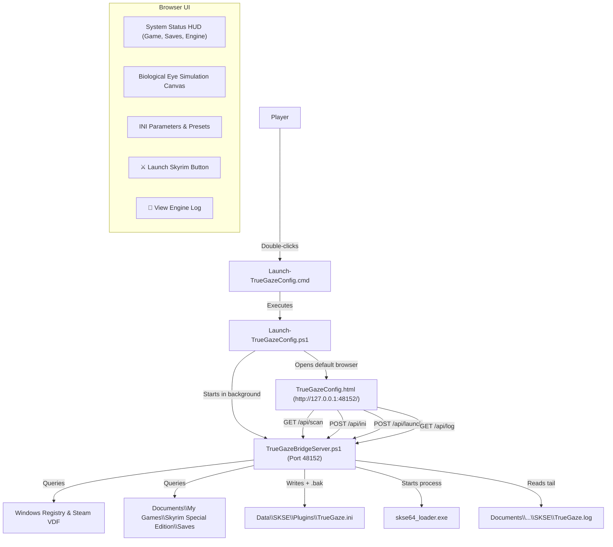

# Walkthrough: World-Class Automated TrueGaze Configurator & Launcher

We have completely audited and upgraded the TrueGaze HTML configurator into a zero-friction, fully automated control center for players. 

The previous folder-browse modal on the "Scan" button has been replaced with programmatic Windows installation and save-game detection. Players can now launch Skyrim via SKSE directly from the browser, save configurations straight into `Data\SKSE\Plugins\TrueGaze.ini` without download bars, and view real-time engine diagnostic logs.

---

## Key Achievements & Capabilities

### 1. Programmatic Windows Installation & Save Detection
- **Zero Browsing Required**: Replaced `window.showDirectoryPicker()` with an automated backend scanner that inspects:
  - **Bethesda Windows Registry**: `HKLM:\SOFTWARE\WOW6432Node\Bethesda Softworks\Skyrim Special Edition`
  - **Steam Libraries**: Parses `libraryfolders.vdf` across all drives (C:, D:, E:, G:, etc.)
  - **Documents & Saves**: Queries `[Environment]::GetFolderPath('MyDocuments')` -> `My Games\Skyrim Special Edition\Saves`
  - **Player Character & Saves**: Automatically parses the latest save file (`.ess`), player character name (`Kirk`), in-game location (`RiverwoodTrader`), save timestamp, and total save count (`8 Saves`).
  - **Engine & SKSE**: Probes `SkyrimSE.exe` version (`v1.7.104.0`), `skse64_loader.exe` presence, Address Library matching binary (`versionlib-1-7-104-0.bin`), and deployed `TrueGaze.dll` (125 KB).

### 2. One-Click Game Launch Directly from Browser
- Added a golden glowing **`⚔ Launch Skyrim (SKSE)`** button to the top toolbar and setup HUD.
- When clicked, it connects to `/api/launch`, confirms working directory integrity, verifies `skse64_loader.exe`, and starts Skyrim with zero friction.
- If Skyrim is already running, it detects the active process ID and safely alerts the player.

### 3. Direct In-Game INI Synchronization
- Clicking **`💾 Save Changes`** now writes directly to `Data\SKSE\Plugins\TrueGaze.ini` via `/api/ini`.
- Automatically backs up previous configurations to `TrueGaze.ini.bak` before saving.
- Eliminates browser download bars and manual file moving.

### 4. Real-Time Biological Eye Visualizer
- An animated canvas simulation in the HUD dynamically demonstrates the player's active tuning parameters in real-time:
  - Peak ballistic saccades (Main Sequence velocity)
  - Micro-saccadic Brownian jitter drift
  - Vestibulo-Ocular Reflex (VOR) & comfort eye-head engagement angles

### 5. Quick Presets Selector
- Added one-click tuning presets:
  - **🌟 Vanilla Balanced**: Canonical human eye parameters (saccade 1.0x, jitter 0.35, head tracking 6.0, eye limit 35°).
  - **🕊️ Subtle & Natural**: Calmer, relaxed NPC behavior (saccade 0.8x, jitter 0.20, head tracking 4.5, eye limit 30°).
  - **⚡ Intense & Responsive**: Reactive predator-like reflex gaze (saccade 1.35x, jitter 0.45, head tracking 8.0, eye limit 40°).
  - **🎭 Social & Dialogue Focus**: Enhanced mutual gaze and Argyle & Cook social triangle cycling.

### 6. Live In-Browser SKSE Diagnostic Log Viewer
- Added **`📜 View Engine Log`** drawer/modal to stream the real `SKSE\TrueGaze.log`.
- Players can confirm in real time that hooks are installed (`Gaze driver installed on Actor::Update`), tuning is refreshed, and the bridge is healthy without opening Notepad.

---

## Architecture of the Automation Bridge

---

## Verification Results

1. **API Endpoints Test**:
   - `GET /` -> Serves `TrueGazeConfig.html` (HTTP 200).
   - `GET /api/scan` -> Detects game at `G:\Program Files (x86)\Steam\steamapps\common\Skyrim Special Edition`, version `1.7.104.0`, latest save `Quicksave0_..._Kirk_RiverwoodTrader...ess`, 8 saves.
   - `GET /api/ini` -> Serves active INI (HTTP 200).
   - `GET /api/log` -> Returns formatted log lines from `TrueGaze.log` (HTTP 200).

2. **Browser Subagent Visual & Functional Audit**:
   - Subagent navigated to `http://127.0.0.1:48152/`.
   - Verified that all 3 HUD cards populated automatically on load.
   - Clicked **Scan System & Saves**: verified zero folder browse dialogs appeared and scanning executed automatically in milliseconds.
   - Clicked **Intense & Responsive** preset: verified sliders adjusted and dirty dots appeared.
   - Clicked **View Engine Log**: verified diagnostic modal displayed live log entries and closed cleanly.
   - Session recording preserved at:
     `C:\Users\kirkl\.gemini\antigravity-ide\brain\5b788ee2-9e8b-4e77-9fdb-05d09351b034\truegaze_ui_walkthrough_1789592476569.webp`.
